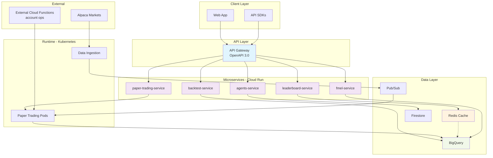
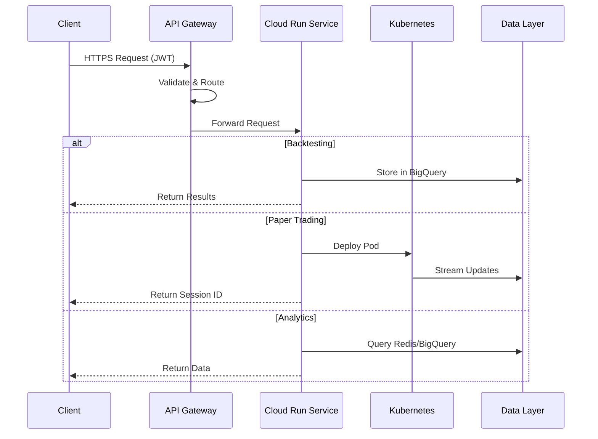

# The Farm Mark II

AI Trading Platform with API Gateway, Cloud Run microservices, and Kubernetes runtime.

## Overview

The Farm Mark II is a microservices-based trading platform that enables users to submit trading strategies for backtesting and paper trading. Built on Google Cloud Platform, it leverages API Gateway for HTTP endpoints, Cloud Run for scalable microservices, and Kubernetes for long-running workloads.

## Architecture

### Components

- **API Gateway** - OpenAPI 3.0 specification, handles authentication and routing
- **Cloud Run Services** (5 microservices)
  - `agents-service` - Agent CRUD operations and validation
  - `backtest-service` - Orchestrates backtesting via Cloud Build
  - `paper-trading-service` - Kicks off paper trading pods in Kubernetes
  - `leaderboard-service` - Redis-cached rankings with BigQuery fallback
  - `fmel-service` - Analytics and decision explainability
- **Kubernetes (GKE)** - Runs paper trading pods and data ingestion
- **External Cloud Functions** - Account operations (separate repository)
- **Data Layer** - BigQuery, Firestore, Redis, Pub/Sub

### High-Level Architecture



### Data Flow



## Project Structure

```
.
├── api-gateway/          # OpenAPI specification
├── services/             # Cloud Run microservices
│   ├── agents-service/
│   ├── backtest-service/
│   ├── paper-trading-service/
│   ├── leaderboard-service/
│   └── fmel-service/
├── containers/           # Docker containers
│   ├── backtest-runner/
│   └── paper-trader/
├── ingesters/            # Market data ingestion
├── kubernetes/           # K8s manifests
├── terraform/            # Infrastructure as code
├── schemas/              # BigQuery schemas
├── scripts/              # Deployment and utilities
├── tests/                # Integration tests
└── docs/                 # Architecture documentation
```

## Key Features

- **Microservices Architecture** - Independent scaling and deployment
- **API Gateway** - Contract-first development with OpenAPI spec
- **Scale to Zero** - Cloud Run services scale down when idle
- **Redis Caching** - Sub-10ms leaderboard response times
- **FMEL** - Complete trading decision explainability
- **Paper Trading** - Alpaca paper accounts with $100k virtual funds

## Deployment

### Prerequisites

- Google Cloud Platform account with billing enabled
- `gcloud`, `terraform`, `kubectl`, `docker` installed
- Project ID and region configured

### Quick Deploy

```bash
# 1. Clone repository
git clone https://github.com/Spooky-Labs/The-Farm-Mark-II.git
cd The-Farm-Mark-II

# 2. Deploy infrastructure (Terraform)
cd terraform
terraform init
terraform plan -var="project_id=YOUR_PROJECT" -var="region=us-central1"
terraform apply

# 3. Deploy services
cd ..
./scripts/deploy.sh YOUR_PROJECT us-central1

# 4. Verify deployment
kubectl get pods --all-namespaces
gcloud run services list
```

## API Endpoints

Base URL: `https://{gateway-url}`

### Agent Management
- `POST /api/agents/submit` - Submit new agent
- `GET /api/agents/list` - List user's agents
- `GET /api/agents/{id}` - Get agent details
- `DELETE /api/agents/{id}` - Delete agent

### Backtesting
- `POST /api/backtest/{agentId}/start` - Start backtest
- `GET /api/backtest/{sessionId}/results` - Get results

### Paper Trading
- `POST /api/paper-trading/start` - Start paper trading
- `GET /api/paper-trading/status/{agentId}` - Check status
- `POST /api/paper-trading/stop` - Stop trading

### Analytics
- `GET /api/leaderboard` - Public leaderboard
- `GET /api/fmel/decisions` - FMEL decision records
- `GET /api/fmel/analytics` - Performance analytics

## Testing

```bash
# Run all tests
./scripts/test-all.sh

# Individual test suites
npm test                          # API tests
python tests/test_integration.py  # Integration tests
./tests/test_terraform.sh        # Infrastructure validation
```

## Configuration

### Environment Variables

Services use these environment variables:
- `PROJECT_ID` - GCP project ID
- `REGION` - Deployment region
- `REDIS_HOST` - Redis instance host
- `FIRESTORE_DATABASE` - Firestore database name

### Secrets

Managed via Google Secret Manager:
- `alpaca-api-key` - Alpaca API key
- `alpaca-secret-key` - Alpaca secret
- `firebase-api-key` - Firebase API key

## Documentation

- [Architecture Guide](docs/ARCHITECTURE.md) - Detailed system design
- [API Reference](api-gateway/openapi-spec.yaml) - OpenAPI specification
- [Deployment Guide](scripts/deploy.sh) - Deployment automation
- [Migration Notes](docs/MIGRATION_GUIDE.md) - From Cloud Functions to microservices

## Monitoring

- **Cloud Run Metrics** - Request latency, error rates, instance count
- **Kubernetes Monitoring** - Pod health, resource utilization
- **BigQuery Analytics** - Query performance, data volume
- **Redis Metrics** - Cache hit rate, memory usage

## Support

- Issues: [GitHub Issues](https://github.com/Spooky-Labs/The-Farm-Mark-II/issues)
- Email: support@spookylabs.com

## License

Proprietary - Spooky Labs

---
*Built by Spooky Labs Engineering*