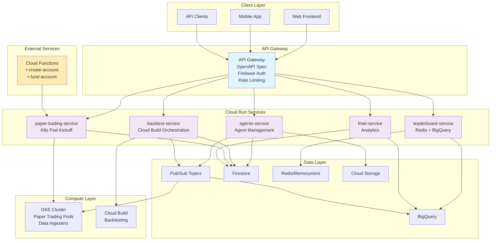
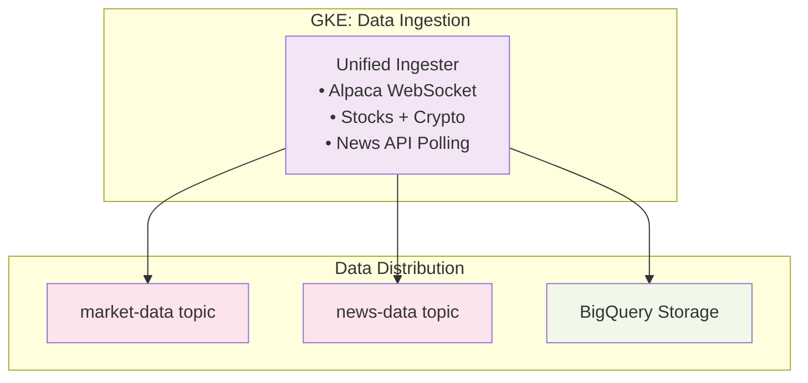
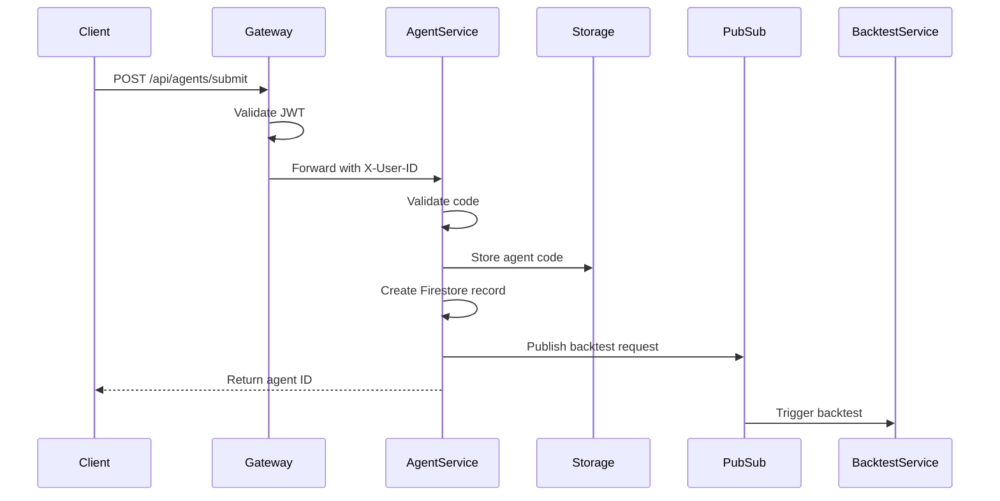
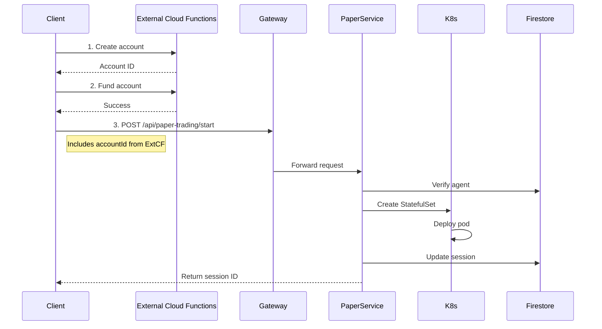
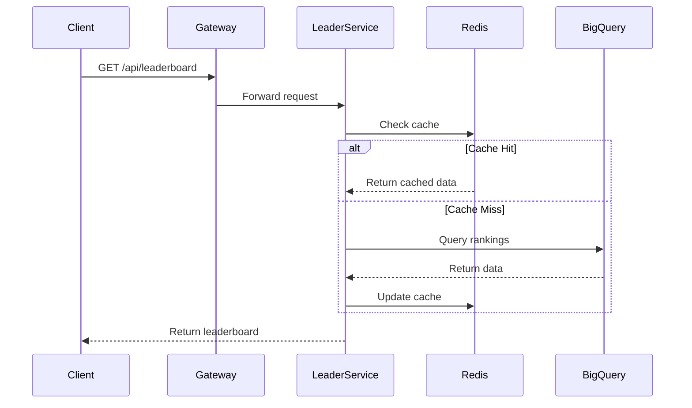

# The Farm Mark II - Microservices Architecture

## Overview

The Farm Mark II is a sophisticated algorithmic trading platform that enables users to submit trading strategies for backtesting and paper trading. The system emphasizes transparency through FMEL (Foundation Model Explainability Layer) and operates on a clean microservices architecture using API Gateway and Cloud Run.

**Key Achievement**: Migrated from monolithic Cloud Functions to API Gateway + Cloud Run microservices, achieving true infrastructure-as-code with OpenAPI specification, improved scalability (32GB RAM/8 vCPU vs 8GB/2 vCPU limits), and cost optimization through scale-to-zero capabilities.

## Core Architecture Principles

1. **API Gateway with OpenAPI**: Contract-first development with automatic validation
2. **Microservices on Cloud Run**: Independent scaling and deployment of services
3. **Data Ingestion in Kubernetes**: Long-running WebSocket connections require persistent containers
4. **Pub/Sub for Asynchronous Processing**: Decouples services and enables event-driven architecture
5. **FMEL Transparency**: Complete decision logging for all trading actions
6. **Redis-Cached Leaderboards**: Sub-10ms response times with BigQuery fallback

## System Architecture

### High-Level Architecture



## Microservices Architecture

### 1. API Gateway

**Technology**: Google Cloud API Gateway
**Configuration**: OpenAPI 3.0 Specification
**Purpose**: Single entry point with built-in features

```yaml
# Key Features from OpenAPI Spec
- Firebase JWT Authentication
- Rate limiting (100 req/min per user)
- Request/response validation
- Automatic API documentation
- Backend service routing
```

### 2. Cloud Run Services

Each service is independently deployable with its own:
- Docker container
- Service account
- Auto-scaling configuration
- Environment variables

#### agents-service
- **Responsibility**: Agent CRUD operations, code validation
- **Dependencies**: Cloud Storage, Firestore, Pub/Sub
- **Triggers**: Automatic backtests on submission
- **Scaling**: 0-100 instances, 1GB RAM, 1 vCPU

#### backtest-service
- **Responsibility**: Orchestrate backtesting via Cloud Build
- **Integration**: Course-1 modular backtesting environment
- **Output**: Results to BigQuery and Cloud Storage
- **Scaling**: 0-100 instances, 1GB RAM, 1 vCPU

#### paper-trading-service
- **Responsibility**: Kick off paper trading sessions in Kubernetes
- **Operations**: Start trading, check status, stop trading
- **Note**: Account creation/funding handled by external Cloud Functions
- **Scaling**: 0-100 instances, 1GB RAM, 1 vCPU

#### leaderboard-service
- **Responsibility**: Fast leaderboard queries
- **Architecture**: Redis cache with BigQuery fallback
- **Performance**: <10ms response time from cache
- **Scaling**: 0-100 instances, 1GB RAM, 1 vCPU

#### fmel-service
- **Responsibility**: FMEL analytics and decision queries
- **Data Source**: BigQuery analytics tables
- **Features**: Confidence distribution, performance metrics
- **Scaling**: 0-100 instances, 1GB RAM, 1 vCPU

#### External Cloud Functions
- **Repository**: https://github.com/Spooky-Labs/Cloud-Functions
- **create-account**: Creates Alpaca paper trading accounts
- **fund-account**: Funds Alpaca accounts with initial capital
- **Purpose**: Handles broker operations before paper trading starts

### 3. Data Ingestion Layer (Kubernetes)

**Location**: GKE Cluster
**Purpose**: Maintain persistent connections to data sources



### 4. Paper Trading Runtime (Kubernetes)

**Location**: GKE StatefulSets
**Purpose**: Execute trading strategies with live data

```yaml
# StatefulSet Configuration
apiVersion: apps/v1
kind: StatefulSet
metadata:
  name: paper-trader-{agentId}
  namespace: paper-trading
spec:
  replicas: 1
  serviceName: paper-trader-{agentId}
  template:
    spec:
      containers:
      - name: paper-trader
        image: gcr.io/{project}/paper-trader:latest
        env:
        - name: MODE
          value: "PAPER"
        - name: AGENT_ID
          value: "{agentId}"
        resources:
          requests:
            memory: "512Mi"
            cpu: "250m"
          limits:
            memory: "2Gi"
            cpu: "1"
```

## Data Flow Patterns

### 1. Agent Submission Flow



### 2. Paper Trading Flow



### 3. Leaderboard Query Flow



## Security Architecture

### Authentication & Authorization

1. **Firebase JWT**: Validated at API Gateway
2. **Service Accounts**: Each Cloud Run service has its own
3. **X-User-ID Header**: Injected by Gateway after validation
4. **Internal API Keys**: For service-to-service communication

### Network Security

```yaml
# VPC Configuration
- Private IP ranges for internal services
- VPC Connector for Cloud Run to GKE
- Firewall rules for egress control
- Network policies in Kubernetes
```

## Performance Optimizations

### 1. Redis Caching Strategy

```javascript
// Leaderboard caching with 30-second TTL
const cacheKey = `leaderboard:${type}:${metric}:${timeframe}`;
await redisClient.setEx(cacheKey, 30, JSON.stringify(data));
```

### 2. BigQuery Partitioning

```sql
-- Partitioned by date for efficient queries
CREATE TABLE market_data.ohlcv
PARTITION BY DATE(timestamp)
CLUSTER BY symbol
```

### 3. Cloud Run Configuration

```yaml
# Optimal settings per service
- Min instances: 0 (scale to zero)
- Max instances: 100
- Memory: 1Gi
- CPU: 1
- Concurrency: 100
- Timeout: 300s
```

## Monitoring & Observability

### Key Metrics

1. **API Gateway**
   - Request latency (p50, p95, p99)
   - Error rates by endpoint
   - Authentication failures

2. **Cloud Run Services**
   - Cold start frequency
   - Instance count
   - Memory/CPU utilization

3. **Kubernetes**
   - Pod status
   - Resource utilization
   - Network traffic

4. **BigQuery**
   - Query performance
   - Slot utilization
   - Storage growth

## Deployment Strategy

### CI/CD Pipeline

```bash
# Deployment sequence
1. Build Docker images
2. Push to Artifact Registry
3. Deploy Cloud Run services
4. Update API Gateway config
5. Apply Kubernetes manifests
6. Run integration tests
```

### Rollback Strategy

```bash
# Quick rollback for issues
1. Revert API Gateway config
2. Deploy previous Cloud Run revision
3. Rollback Kubernetes deployments
```

## Cost Optimization

### Scale-to-Zero Benefits

- **Cloud Run**: No charges when idle
- **Estimated savings**: 60-70% vs always-on Cloud Functions
- **BigQuery**: Partition expiration for old data
- **Storage**: Lifecycle policies for backtest results

## Future Enhancements

1. **GraphQL API**: Alternative to REST
2. **WebSocket Support**: Real-time updates
3. **Multi-region**: Global deployment
4. **ML Pipeline**: Advanced strategy optimization
5. **Event Sourcing**: Complete audit trail