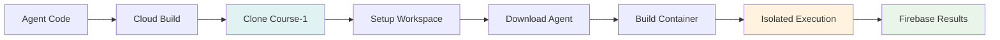
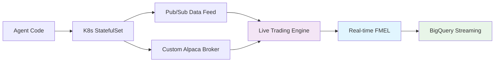

# Agent Runtime Documentation

## Overview

The Agent Runtime is the execution environment for trading agents. We use two different execution models:
- **Cloud Build**: For backtesting (isolated container execution)
- **Kubernetes**: For paper trading (long-running StatefulSets)

Both environments include FMEL recording for complete decision transparency.

## Architecture

### Backtesting (Cloud Build with Course-1)


### Paper Trading (Kubernetes)


## Execution Modes

### Backtest Mode (Cloud Build with Course-1)
- Uses Course-1 repository for proven backtesting infrastructure
- Isolated container execution with network isolation
- Historical data and runner framework from Course-1
- Results stored in Firebase Realtime Database
- Automatic agent code download from Cloud Storage
- Security-hardened execution environment

### Paper Trading Mode (Kubernetes)
- StatefulSet deployment
- Real-time Alpaca market data
- Live order execution (paper account)
- Streaming FMEL to BigQuery
- Persistent state management

## Container Environment

### Base Image (from Course-1)
```dockerfile
# Uses Dockerfile from Course-1 repository
FROM python:3.11-slim

# Pre-installed packages from Course-1/requirements.txt
- backtrader>=1.9.76.123
- alpaca-trade-api==3.0.0  # Alpaca integration
- pandas==2.0.3
- numpy==1.24.3
- firebase-admin  # Firebase integration
- Additional dependencies from Course-1
```

### Resource Limits

```yaml
resources:
  requests:
    cpu: "500m"      # Half CPU
    memory: "1Gi"    # 1GB RAM
  limits:
    cpu: "2"         # 2 CPUs max
    memory: "4Gi"    # 4GB RAM max
```

## Agent Code Requirements

### Minimal Agent

```python
import backtrader as bt

class MinimalStrategy(bt.Strategy):
    def next(self):
        if not self.position:
            self.buy()
        else:
            self.sell()
```

### Full Featured Agent

```python
import backtrader as bt
import numpy as np

class AdvancedStrategy(bt.Strategy):
    params = (
        ('sma_period', 20),
        ('rsi_period', 14),
        ('risk_percent', 0.02),
    )

    def __init__(self):
        # Indicators
        self.sma = bt.indicators.SMA(period=self.p.sma_period)
        self.rsi = bt.indicators.RSI(period=self.p.rsi_period)

        # Track orders
        self.order = None

    def next(self):
        # Skip if order pending
        if self.order:
            return

        # Entry logic
        if not self.position:
            if self.rsi < 30 and self.data.close > self.sma:
                size = self.calculate_position_size()
                self.order = self.buy(size=size)

        # Exit logic
        else:
            if self.rsi > 70 or self.data.close < self.sma * 0.95:
                self.order = self.close()

    def calculate_position_size(self):
        # Risk management
        risk_amount = self.broker.cash * self.p.risk_percent
        return int(risk_amount / self.data.close)

    def notify_order(self, order):
        if order.status in [order.Completed]:
            self.order = None

    # Note: FMEL recording happens automatically
    # The FMELRecorder analyzer captures all state and actions
    # No need to implement special methods
```

## Deployment Process

### 1. Agent Submission
```python
POST /api/agents/submit
→ Validate Python syntax
→ Store in Cloud Storage
→ Register in Firebase
```

### 2. Backtest Execution (Cloud Build)
```python
POST /api/backtest/run
→ Trigger Cloud Build
→ Build container with agent code
→ Execute in isolated environment
→ Run Backtrader with FMEL Recorder
→ Store all records in BigQuery
```

### 3. Paper Trading (Kubernetes)
```python
POST /api/paper-trading/start
→ Deploy K8s StatefulSet
→ Connect to Alpaca Paper Account
→ Stream real-time market data
→ Execute strategy with FMEL
→ Stream decisions to BigQuery
```

## Deployment Configurations

### Cloud Build for Backtesting (Course-1 Integration)
```yaml
# cloudbuild.yaml - Course-1 Pattern
steps:
  # Clone Course-1 repository
  - name: 'gcr.io/cloud-builders/git'
    args: ['clone', 'https://github.com/Spooky-Labs/Course-1.git']
    id: 'clone-course-1'

  # Setup workspace with Course-1 files
  - name: 'ubuntu'
    args: ['-c', 'mv /workspace/Course-1/Dockerfile /workspace']
    entrypoint: 'bash'
    id: 'move-dockerfile'

  # Download agent code from Cloud Storage
  - name: 'gcr.io/cloud-builders/gsutil'
    args: ['-m', 'cp', '-r', 'gs://bucket/agents/userId/agentId', '/workspace/agent']
    id: 'copy-agent-from-storage'

  # Build container with security flags
  - name: 'gcr.io/cloud-builders/docker'
    args: ['build', '-t', 'backtest-image', '.']
    extra_args: ['--network=none', '--no-cache', '--cap-drop=ALL']

  # Run isolated backtest
  - name: 'gcr.io/cloud-builders/docker'
    args: ['-c', 'docker run --rm --network=none --read-only backtest-image > output.json']
    entrypoint: 'bash'

  # Store results in Firebase
  - name: 'node:22'
    args: ['-c', 'npm install -g firebase-tools && firebase database:update /results output.json']
    entrypoint: 'bash'

timeout: 1200s  # 20 minute limit
```

### Paper Trading StatefulSet
```yaml
apiVersion: apps/v1
kind: StatefulSet
metadata:
  name: paper-{agent-id}
spec:
  replicas: 1
  template:
    spec:
      containers:
      - name: agent-runtime
        image: gcr.io/project/agent-runtime
        env:
        - name: MODE
          value: "PAPER_TRADE"
```

## Data Access

### Market Data Loading

```python
# Automatic data loading based on permissions
def load_historical_data(self):
    config = self.get_data_config()
    symbols = config.get('allowed_symbols', ['SPY'])

    for symbol in symbols:
        df = self.query_bigquery(symbol)
        data_feed = bt.feeds.PandasData(dataname=df)
        self.cerebro.adddata(data_feed)
```

### Data Access (Alpaca Exclusive)

```python
# All market data comes from Alpaca
class AlpacaStrategy(bt.Strategy):
    def __init__(self):
        # Market data automatically loaded from Alpaca
        # News data available if configured
        self.sma = bt.indicators.SMA(period=20)

    def next(self):
        # Strategy uses Alpaca data
        if self.data.close > self.sma:
            self.buy()

# News data integration (if enabled)
def get_news_sentiment(symbol, timestamp):
    # Query news data from BigQuery
    return news_sentiment
```

## Performance Monitoring

### Metrics Collected

- **Execution Time**: Backtest duration
- **Memory Usage**: Peak RAM consumption
- **CPU Usage**: Average CPU utilization
- **Decision Count**: FMEL decisions captured
- **Error Rate**: Failures and exceptions

### Health Checks

```python
@app.route('/health')
def health():
    return {
        'status': 'healthy',
        'agent_id': AGENT_ID,
        'mode': MODE,
        'uptime': get_uptime()
    }
```

## Security

### Sandboxing
- Runs as non-root user
- Read-only filesystem
- No network access (except data APIs)
- Resource limits enforced

### Code Validation
- Python syntax checking
- Import restrictions
- No filesystem access
- No subprocess execution

## Error Handling

### Common Errors

**Import Error**
```python
ImportError: No module named 'tensorflow'
```
Solution: Only pre-approved packages available

**Memory Error**
```python
MemoryError: Unable to allocate array
```
Solution: Optimize data usage, reduce lookback period

**Timeout Error**
```python
TimeoutError: Backtest exceeded 10 minutes
```
Solution: Simplify strategy, reduce data range

## Debugging

### Local Testing

```bash
# Test agent locally
cd containers/paper-trader
docker build -t agent-test .
docker run -e AGENT_ID=test agent-test
```

### Production Logs

```bash
# View backtest logs (Cloud Build)
gcloud builds log ${BUILD_ID}

# View paper trading logs (Kubernetes)
kubectl logs statefulset/paper-{agent-id} -n trading-agents

# Query FMEL records
bq query --use_legacy_sql=false '
  SELECT * FROM fmel.trading_decisions
  WHERE agent_id = "agent-123"
  ORDER BY timestamp DESC
  LIMIT 100'
```

### FMEL Analysis

```python
# Query FMEL records from BigQuery
from google.cloud import bigquery

client = bigquery.Client()
query = f"""
    SELECT
        timestamp,
        bar_number,
        complete_state_hash,
        actions_taken
    FROM `{project_id}.fmel.trading_decisions`
    WHERE agent_id = @agent_id
    ORDER BY timestamp
"""

job_config = bigquery.QueryJobConfig(
    query_parameters=[
        bigquery.ScalarQueryParameter("agent_id", "STRING", agent_id)
    ]
)

results = client.query(query, job_config=job_config)

# Analyze complete decision history
for row in results:
    print(f"{row.timestamp}: Bar {row.bar_number}, Actions: {row.actions_taken}")
```

## Performance Optimization

### Strategy Optimization

1. **Reduce Indicators**: Only essential calculations
2. **Limit Lookback**: Shorter historical windows
3. **Batch Operations**: Process multiple symbols together
4. **Cache Calculations**: Store repeated computations

### Data Optimization

1. **Downsample**: Use appropriate timeframes
2. **Filter Symbols**: Only necessary tickers
3. **Limit History**: Reasonable date ranges
4. **Compress Storage**: Use efficient formats

## Best Practices

### Code Structure

```python
class WellStructuredStrategy(bt.Strategy):
    # 1. Define parameters
    params = (('period', 20),)

    # 2. Initialize indicators
    def __init__(self):
        self.sma = bt.indicators.SMA(period=self.p.period)

    # 3. Implement logic
    def next(self):
        if self.data.close > self.sma:
            self.buy()

    # 4. Handle notifications
    def notify_order(self, order):
        pass

    # 5. FMEL records automatically
    # No special methods needed - FMELRecorder captures everything
```

### Risk Management

```python
def calculate_position_size(self):
    # Never risk more than 2% per trade
    max_risk = self.broker.cash * 0.02
    stop_distance = self.atr[0] * 2
    shares = int(max_risk / stop_distance)
    return min(shares, self.max_position)
```

## Scaling Considerations

### Horizontal Scaling
- Multiple agents run in parallel
- Each agent isolated in pod
- Auto-scaling based on queue

### Vertical Scaling
- Increase resource limits
- Use larger node pools
- Optimize memory usage

## Future Enhancements

### Planned Features

1. **GPU Support**: For ML models
2. **Custom Indicators**: User libraries
3. **Multi-Asset**: Futures, options
4. **Live Trading**: Real money execution

### Research Areas

1. **Strategy Optimization**: Genetic algorithms
2. **Auto-FMEL**: Automatic reasoning
3. **Performance Prediction**: ML-based
4. **Risk Analysis**: Real-time monitoring