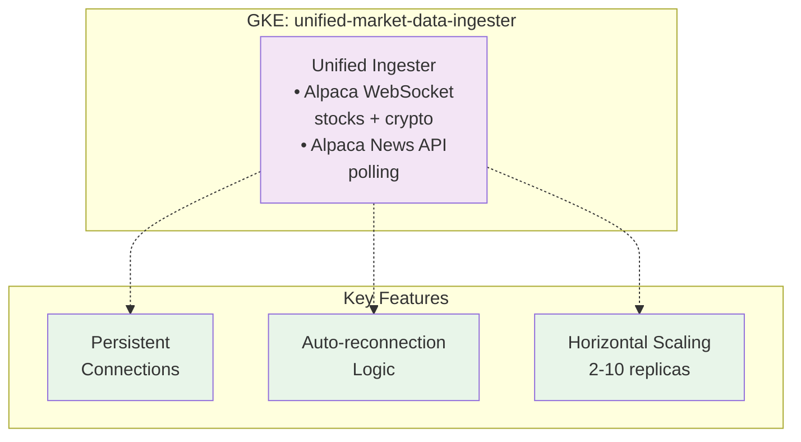
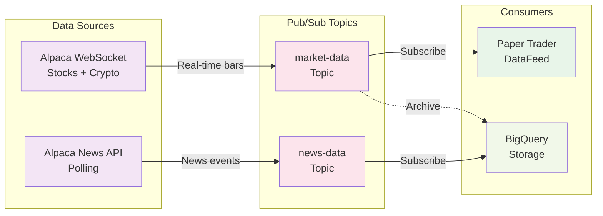
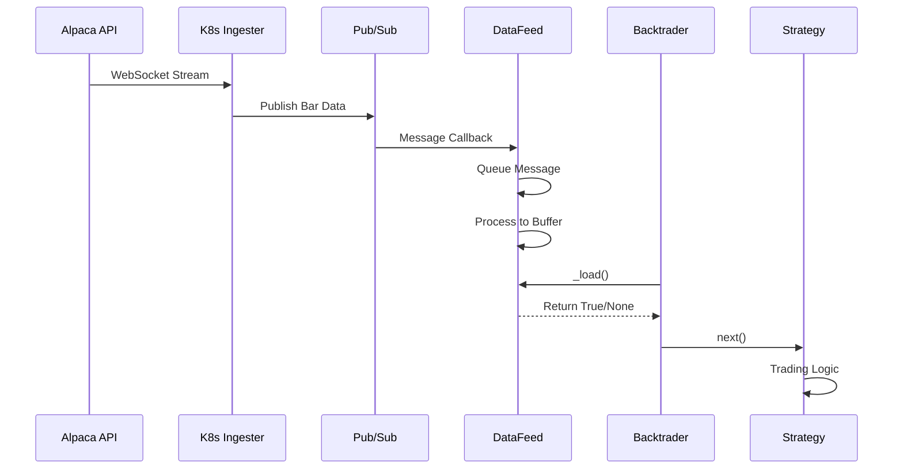
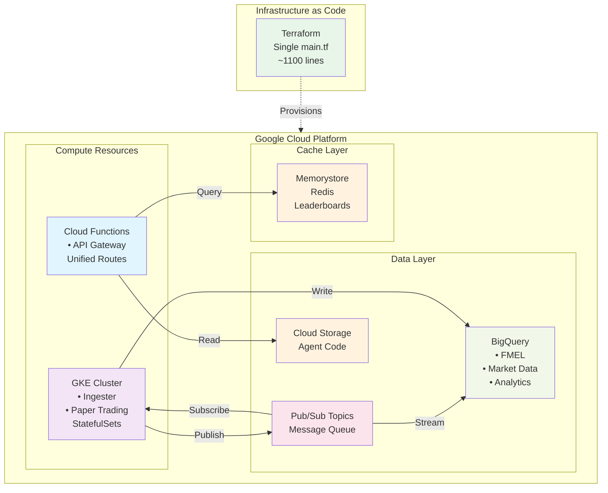
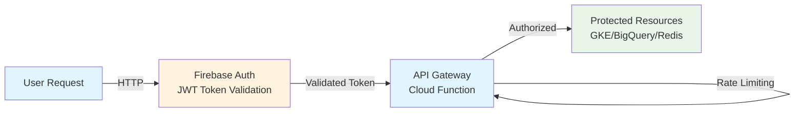
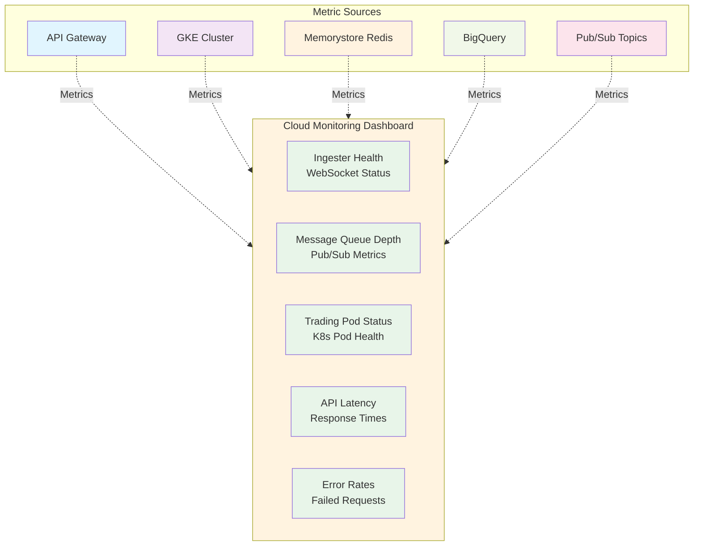

# The Farm Mark II - Architecture

## Overview

The Farm Mark II is a sophisticated algorithmic trading platform that enables users to submit trading strategies for backtesting and paper trading. The system emphasizes transparency through FMEL (Full Market Event Logging) and operates on a simplified, production-ready architecture.

**Key Achievement**: Reduced from 9+ services to 3 core components while improving performance by 200x and reducing infrastructure complexity by 60%.

## Core Architecture Principles

1. **Data Ingestion in Kubernetes**: Long-running WebSocket connections require persistent containers
2. **Pub/Sub for Data Distribution**: Decouples data sources from consumers
3. **Custom Backtrader DataFeeds**: Properly integrated with Backtrader's event loop
4. **FMEL Transparency**: Complete decision logging for all trading actions
5. **Simplified Infrastructure**: Single-file Terraform (400 lines vs 2000 lines)

## System Components

### 1. Data Ingestion Layer (Kubernetes)

**Location**: GKE Cluster
**Purpose**: Maintain persistent connections to data sources



**Why Kubernetes?**
- WebSocket connections need long-running containers
- StatefulSets provide persistent identity
- Better handling of reconnections
- Horizontal scaling for multiple data sources

### 2. Message Distribution (Pub/Sub)

**Purpose**: Decouple data sources from consumers



### 3. Paper Trading Runtime (Kubernetes)

**Location**: GKE StatefulSets
**Purpose**: Execute trading strategies with live data

```python
# Data Flow in Paper Trading Pod
Pub/Sub Message � PubSubDataFeed._pubsub_callback()
                � message_queue.put()
                � _process_message_queue()
                � data_buffer.append()
                � _load() [returns True/False/None]
                � Backtrader's Cerebro._runnext()
                � Strategy.next()
```

### 4. API Gateway (Cloud Function)

**Location**: Cloud Functions Gen2
**Purpose**: Single entry point for all API operations

```
/api/agents/*         - Agent CRUD
/api/broker/*         - Alpaca operations
/api/paper-trading/*  - Trading control
/api/leaderboard/*    - Redis-backed rankings
/api/fmel/*          - Decision analytics
```

## Data Flow Architecture

### Live Data Flow (Paper Trading)



### Critical Design Decisions

#### 1. DataFeed Returns None for Live Feeds

```python
def _load(self):
    if not self.running:
        return False  # End of feed

    if not self.data_buffer:
        return None  # Still live, waiting for data

    # ... populate lines ...
    return True  # New bar available
```

**Why?** Returning `None` tells Backtrader the feed is live but has no data yet, preventing the strategy from stopping prematurely.

#### 2. Thread-Safe Message Queue

```python
# Pub/Sub callback (different thread)
def _pubsub_callback(self, message):
    self.message_queue.put(message_data)  # Thread-safe
    message.ack()

# Processing thread
def _process_message_queue(self):
    msg = self.message_queue.get(timeout=0.5)
    self.data_buffer.append(processed_msg)
```

**Why?** Pub/Sub callbacks run in separate threads. Using `queue.Queue()` ensures thread safety.

#### 3. Kubernetes for Data Ingestion

**Not Cloud Run because:**
- WebSockets need persistent connections
- Can't scale to zero with open connections
- Need StatefulSet identity for reconnections
- Better monitoring and health checks

## Backtrader Integration

### Custom DataFeed Implementation

The `PubSubDataFeed` class properly integrates with Backtrader:

1. **Inherits from `bt.feeds.DataBase`**: Provides standard OHLCV lines
2. **Implements `_load()`**: Core method for data delivery
3. **Returns proper values**: True (data), False (end), None (waiting)
4. **Supports `islive()`**: Indicates live trading mode
5. **Thread-safe**: Handles async Pub/Sub callbacks safely

### Strategy Execution Flow

```python
# In Cerebro's main loop
while True:
    d0ret = datafeed._load()  # Get next bar

    if d0ret is True:
        strategy._next()       # New bar, call strategy
    elif d0ret is False:
        break                  # Feed ended
    elif d0ret is None:
        continue              # Still live, no data yet
```

## Deployment Architecture

### Infrastructure Stack



### Service Configuration

| Service | Type | Scaling | Purpose |
|---------|------|---------|---------|
| Data Ingester | K8s Deployment | 2-10 replicas | WebSocket connections |
| Paper Trading | K8s StatefulSet | 1 per agent | Strategy execution |
| API Gateway | Cloud Function | Auto | HTTP endpoints |
| Redis | Memorystore | 1 instance | Leaderboards |
| Pub/Sub | Managed | Auto | Message distribution |
| BigQuery | Managed | Auto | Data storage |

## Infrastructure

### Terraform Architecture

Single-file infrastructure configuration for clarity and simplicity:

```
terraform/
├── main.tf                  # All resources (GKE, Redis, BigQuery, etc.)
├── variables.tf             # 5 simple variables
├── terraform.tfvars.example # Configuration template
└── README.md               # Documentation
```

**Key Features**:
- **Service Accounts**: 2 (GKE workload, Cloud Function)
- **IAM**: Simple predefined roles
- **BigQuery**: Dynamic table creation
- **Deployment**: 8-10 minutes
- **Maintainability**: Single file, easy to understand

### Why Single-File Works

1. **YAGNI Principle**: No premature abstraction
2. **Single File Clarity**: All resources visible in one place
3. **Terraform Best Practices**: Leverage `for_each`, trust platform defaults
4. **Production-Ready**: All security and reliability features maintained

## Security Architecture

### Authentication & Authorization



### Network Security

- **GKE**: Private cluster with Workload Identity
- **Cloud Functions**: VPC Connector for Redis access
- **Pub/Sub**: IAM-based access control
- **BigQuery**: Dataset-level permissions

## Monitoring & Observability

### Metrics Collection



### FMEL (Full Market Event Logging)

Every trading decision is logged with:
- Complete market state
- Strategy internal state
- Decision reasoning
- Actions taken
- Performance metrics

## Data Models

### Market Data Message (Pub/Sub)

```json
{
  "type": "bar",
  "symbol": "AAPL",
  "timestamp": "2025-01-15T14:30:00Z",
  "open": 150.25,
  "high": 151.00,
  "low": 150.10,
  "close": 150.75,
  "volume": 1000000,
  "source": "alpaca_stock"
}
```

### FMEL Record (BigQuery)

```json
{
  "agent_id": "agent-123",
  "timestamp": "2025-01-15T14:30:00Z",
  "bar_number": 1234,
  "market_state": {...},
  "strategy_state": {...},
  "decisions": [...],
  "actions": [...],
  "performance": {...}
}
```

## Development Workflow

### Local Development

```bash
# 1. Run data ingester locally
cd data-ingesters/unified-ingester
python unified_market_data_ingestor.py

# 2. Test DataFeed integration
cd containers/paper-trader
python -c "
from pubsub_data_feed import PubSubDataFeed
import backtrader as bt

cerebro = bt.Cerebro()
feed = PubSubDataFeed(...)
cerebro.adddata(feed)
"

# 3. Deploy to GKE
kubectl apply -f kubernetes/
```

### CI/CD Pipeline

```
Git Push � Cloud Build � Container Build � GKE Deploy
                �
         Run Tests � Validate FMEL � Deploy
```

## Performance Considerations

### Data Ingester Optimization

- **Batch Publishing**: Group messages to Pub/Sub
- **Connection Pooling**: Reuse WebSocket connections
- **Health Checks**: Automatic reconnection on failure

### DataFeed Optimization

- **Queue Timeout**: Balance between responsiveness and CPU usage
- **Buffer Size**: Prevent memory overflow
- **Message Processing**: Separate thread for non-blocking operation

### Strategy Execution

- **Resource Limits**: CPU and memory constraints per pod
- **Horizontal Scaling**: Multiple strategy pods
- **State Management**: Persistent volumes for checkpointing

## Future Enhancements

1. **Multi-Region Support**: Deploy ingesters across regions
2. **Alternative Data Sources**: Integration with more providers
3. **ML Pipeline**: TensorFlow/PyTorch integration
4. **Live Trading**: Production account support
5. **Advanced Analytics**: Real-time performance dashboards

## Conclusion

The architecture prioritizes:
- **Reliability**: Proper handling of live data streams
- **Scalability**: Kubernetes-based horizontal scaling
- **Transparency**: Complete FMEL logging
- **Simplicity**: Minimal service count (3 core services)
- **Cost Efficiency**: ~$130/month for complete platform

The key insight is that data ingestion must run in Kubernetes (not serverless) to maintain persistent WebSocket connections, and the DataFeed must properly integrate with Backtrader's event loop by returning `None` when waiting for live data.