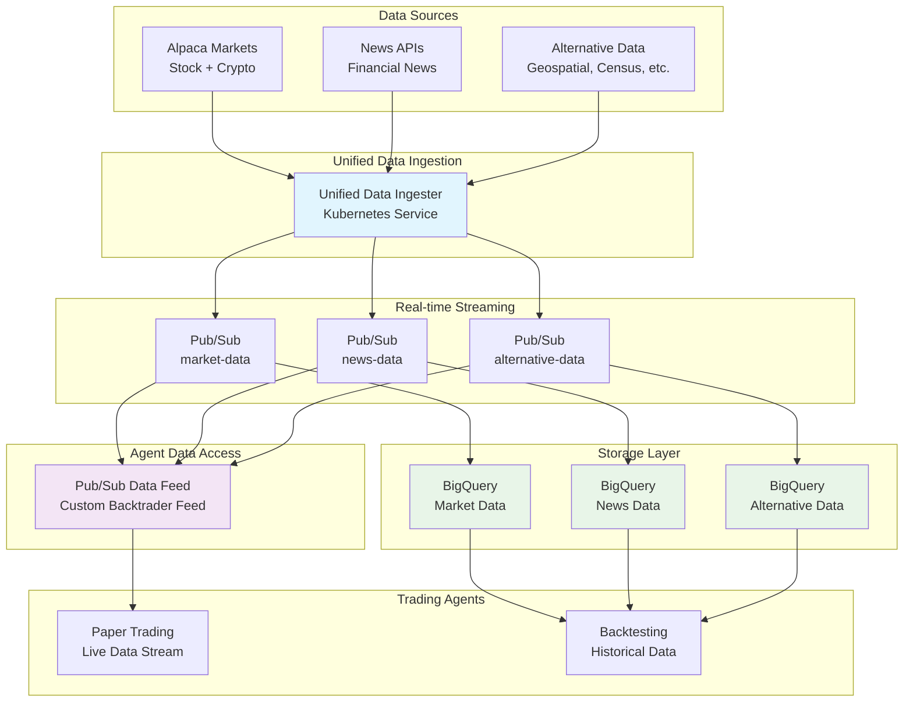

# Data Platform Documentation

## Overview

The Spooky Labs Data Platform provides unified access to market data (via Alpaca) and news data for trading agents. The platform is designed for Milestone 0 with a clear path to expand for future milestones. All market data comes exclusively from Alpaca, ensuring consistency and reliability.

## Data Sources

### Market Data (Alpaca Exclusive)
- **Stock Prices**: Real-time and historical equity data
- **Crypto Prices**: 24/7 cryptocurrency markets
- **Bars**: OHLCV data at various timeframes
- **Trades**: Individual trade data
- **Quotes**: Bid/ask spread data
- **Corporate Actions**: Splits, dividends, etc.

### News Data
- **Financial News**: Market-moving news articles
- **Company News**: Stock-specific news
- **Economic News**: Macro events and indicators
- **Sentiment Analysis**: Pre-computed sentiment scores (future)

### Future Data Sources (Post Milestone 0)
- **Alternative Data**: Satellite, foot traffic, etc.
- **Social Sentiment**: Reddit, Twitter analysis
- **Economic Indicators**: Census, employment data

## Architecture



## Developer Data Control

### Configuration per Agent

```python
# Developers configure data access for their agents
agent_config = {
    'allowed_symbols': ['AAPL', 'GOOGL', 'TSLA'],  # Specific stocks
    'allowed_crypto': ['BTC/USD', 'ETH/USD'],       # Specific crypto
    'data_sources': {
        'alpaca_market': True,   # Market data via Alpaca
        'alpaca_news': True,     # News via Alpaca
        'news_api': True         # Additional news source
    },
    'historical_days': 365,      # Lookback limit for backtesting
    'real_time': True            # Enable real-time data for paper trading
}
```

### Data Access Filters

```python
# Control what data the agent sees
'data_filters': {
    'market_data': {
        'exchanges': ['NYSE', 'NASDAQ'],  # Only major exchanges
        'min_volume': 1000000              # Liquidity filter
    },
    'news': {
        'categories': ['earnings', 'merger', 'regulation'],
        'min_relevance': 0.7               # Relevance threshold
    }
}
```

## Data Schemas

### Market Data (from Alpaca)

```python
{
    'symbol': 'AAPL',
    'timestamp': '2024-01-15T10:00:00Z',
    'open': 150.25,
    'high': 151.00,
    'low': 149.50,
    'close': 150.75,
    'volume': 50000000,
    'vwap': 150.60,
    'trade_count': 250000
}
```

### News Data

```python
{
    'id': 'news-12345',
    'headline': 'Apple Reports Q4 Earnings',
    'summary': 'Apple Inc. reported...',
    'author': 'Reuters',
    'created_at': '2024-01-15T09:30:00Z',
    'updated_at': '2024-01-15T09:35:00Z',
    'symbols': ['AAPL'],
    'url': 'https://...',
    'images': [...],
    'sentiment': 0.7  # If available
}
```

## Data Access in Agents

### Simple Interface

```python
# Agent code - access Alpaca data
from alpaca_trade_api import REST
from agent_data_interface import AgentDataInterface

# Market data via Alpaca
alpaca = REST(api_key, secret_key, base_url)

# Get historical bars
bars = alpaca.get_bars(
    'AAPL',
    TimeFrame.Day,
    start='2024-01-01',
    end='2024-01-15'
).df

# Get news data
data = AgentDataInterface(agent_id)
news = data.get_news(
    symbols=['AAPL', 'GOOGL'],
    start_date=datetime.now() - timedelta(days=7)
)
```

### Automatic Permission Filtering

- Agent requests ANY data
- System checks permissions
- Only allowed data returned
- Usage tracked for billing

## Data Pipeline

### Ingestion Flow

1. **Data Sources** publish to Pub/Sub topics
2. **Dataflow Pipeline** processes and normalizes
3. **BigQuery** stores for analytics
4. **Agents** query through controlled interface

### Storage Strategy

- **Real-time Data**: Pub/Sub for streaming
- **Historical Data**: BigQuery for all market and news data
- **FMEL Records**: BigQuery with content-addressable storage
- **Archive**: Cloud Storage for long-term retention

## Cost Management

### Data Costs (Milestone 0)

- **Alpaca Market Data**: Included with API key
- **News API**: ~$50/month for premium tier
- **BigQuery Storage**: ~$0.02/GB/month
- **BigQuery Queries**: ~$5/TB scanned

### Cost Optimization

```python
# Partition tables by date
CREATE TABLE market_data
PARTITION BY DATE(timestamp)
CLUSTER BY symbol

# Use materialized views for common queries
CREATE MATERIALIZED VIEW daily_ohlc AS
SELECT symbol, DATE(timestamp) as date,
       FIRST_VALUE(open), MAX(high), MIN(low), LAST_VALUE(close)
FROM market_data
GROUP BY symbol, date
```

## Data Ingestion Services

### Alpaca Market Data Ingestion

```python
# data-ingesters/alpaca-websocket-streamer/main.py
from alpaca_trade_api import REST
from google.cloud import bigquery

class AlpacaIngestor:
    def __init__(self):
        self.alpaca = REST(
            os.environ['ALPACA_API_KEY'],
            os.environ['ALPACA_SECRET_KEY']
        )
        self.bq = bigquery.Client()

    async def ingest_bars(self, symbols, timeframe):
        """Fetch and store market data"""
        for symbol in symbols:
            bars = self.alpaca.get_bars(
                symbol, timeframe,
                start=self.last_update,
                end=datetime.now()
            ).df

            # Write to BigQuery
            self.bq.insert_rows_from_dataframe(
                bars, f'{project}.market_data.bars'
            )
```

### News Data Ingestion

```python
# data-ingesters/unified-ingester/main.py
from newsapi import NewsApiClient

class NewsIngestor:
    def __init__(self):
        self.newsapi = NewsApiClient(
            api_key=os.environ['NEWS_API_KEY']
        )
        self.bq = bigquery.Client()

    async def ingest_news(self):
        """Fetch and store news articles"""
        articles = self.newsapi.get_everything(
            q='stocks OR trading OR markets',
            language='en',
            sort_by='relevancy'
        )

        # Process and store
        self.store_articles(articles)
```

## Data Quality

### Metrics Tracked

- **Completeness**: Fields populated
- **Freshness**: Age of data
- **Volume**: Records processed
- **Accuracy**: Validation checks

### Data Quality Approach

We provide raw data without subjective quality scores:
- **Completeness**: All fields from source preserved
- **Timeliness**: Timestamp of data receipt
- **Source**: Clear attribution (Alpaca, News API, etc.)
- **No Filtering**: Agents decide what's relevant

Agents make their own decisions about data quality and relevance.

## Security

### Access Control
- Service account per data source
- IAM policies for least privilege
- Audit logging of all access

### Data Protection
- Encryption at rest
- TLS for transit
- PII redaction
- GDPR compliance

## Performance

### Optimization Strategies

1. **Caching**: Frequently accessed data in memory
2. **Partitioning**: BigQuery tables by date
3. **Clustering**: By symbol for fast lookups
4. **Compression**: 70% reduction with gzip

### Query Performance

- Point queries: < 100ms
- Range queries: < 1s
- Aggregations: < 5s
- Full scans: Discouraged

## Monitoring

### Key Metrics

```sql
-- Data freshness by source
SELECT
  source,
  MAX(timestamp) as latest_data,
  DATETIME_DIFF(CURRENT_DATETIME(), MAX(timestamp), MINUTE) as minutes_lag
FROM `universal_data.all_sources`
GROUP BY source
```

### Alerts

- Data source offline > 1 hour
- Error rate > 1%
- Query latency > 5s
- Budget exceeded

## Future Enhancements

### Milestone 1 Additions

1. **Options Data**: via Alpaca or other providers
2. **International Markets**: Global equity data
3. **Alternative Data**: Satellite, social sentiment, etc.
4. **Custom Indicators**: Pre-computed technical indicators

### Potential Features

1. **WebSocket Streaming**: Real-time data feeds
2. **Data Marketplace**: Users share/sell datasets
3. **ML-Ready Features**: Normalized, cleaned datasets
4. **Historical Replay**: Point-in-time data reconstruction

## API Reference

### Get Market Data

```python
GET /api/data/market
Parameters:
  - symbols: List of tickers
  - start_date: ISO timestamp
  - end_date: ISO timestamp
  - interval: 1m, 5m, 1h, 1d

Response:
{
  "data": [...],
  "usage": {
    "calls": 1,
    "cost": 0.001
  }
}
```

### Get Alternative Data

```python
GET /api/data/alternative
Parameters:
  - source: Data source ID
  - filters: Source-specific filters
  - start_date: ISO timestamp
  - end_date: ISO timestamp

Response:
{
  "data": [...],
  "usage": {
    "calls": 1,
    "cost": 0.01
  }
}
```

## Troubleshooting

### No Data Returned

- Check agent permissions
- Verify data source enabled
- Check budget limits
- Review time range

### Slow Queries

- Reduce time range
- Add specific filters
- Use sampling
- Check quota limits

### Access Denied

- Verify authentication
- Check IAM roles
- Review agent config
- Check firewall rules