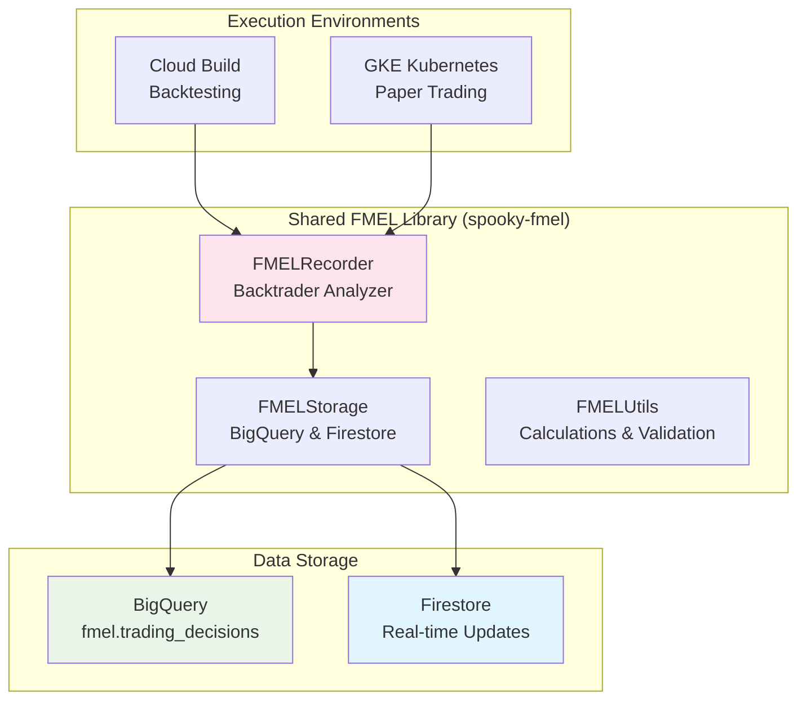

# FMEL Implementation - Unified Shared Library

## Overview

FMEL (Foundation Model Explainability Layer) is implemented as a **unified shared library** (`spooky-fmel`) that provides a single Backtrader Analyzer for recording every decision made by AI trading agents in both backtesting and paper trading environments.

## Key Improvements

✅ **Unified Implementation**: Single library replaces separate FMEL recorders
✅ **Consistent Recording**: Identical decision capture across all execution modes
✅ **Simplified Maintenance**: One codebase for all FMEL functionality
✅ **Production Ready**: Comprehensive error handling and monitoring

## Architecture



---

## 1. Shared FMEL Library

### Package Structure
```
shared/fmel-library/
├── setup.py
├── requirements.txt
├── README.md
└── spooky_fmel/
    ├── __init__.py
    ├── recorder.py      # Main FMELRecorder Analyzer
    ├── storage.py       # BigQuery & Firestore integration
    └── utils.py         # Utilities and calculations
```

### Installation

**In containers:**
```dockerfile
COPY shared/fmel-library /app/fmel-library
RUN pip install -e /app/fmel-library
```

**For local development:**
```bash
pip install -e /path/to/shared/fmel-library
```

See `shared/fmel-library/README.md` for detailed documentation.

---

## 2. FMELRecorder - Unified Backtrader Analyzer

### FMEL Data Flow

```mermaid
sequenceDiagram
    participant S as Strategy.next()
    participant F as FMELRecorder<br/>Analyzer
    participant E as Environment<br/>Detection
    participant BQ as BigQuery<br/>fmel.trading_decisions
    participant FS as Firestore<br/>Real-time

    S->>F: Trading decision made
    F->>F: Capture context<br/>Market, Portfolio, Indicators
    F->>E: Check MODE env var

    alt MODE = BACKTEST
        E->>F: Batch mode
        F->>F: Accumulate in memory
        Note right of F: Upload all at end
        F->>BQ: Batch insert<br/>1000s of records
    else MODE = PAPER
        E->>F: Real-time mode
        F->>BQ: Stream insert<br/>Immediate write
        F->>FS: Update agent doc<br/>Live dashboard
    end

    style S fill:#e8f5e9
    style F fill:#fce4ec
    style E fill:#fff3e0
    style BQ fill:#f1f8e9
    style FS fill:#e1f5fe
```

### Core Features

**Complete Decision Capture:**
- Every `next()` call recorded with full context
- Market data, indicators, portfolio state
- Order events (submission, execution, cancellation)
- Trade events (opening, closing, P&L)
- Agent reasoning and confidence scores

**Dual Mode Support:**
- **Backtesting**: Batch upload to BigQuery at completion
- **Paper Trading**: Real-time streaming to BigQuery + Firestore

**Environment Detection:**
```python
# Automatic mode detection via environment variables
os.environ['MODE'] = 'BACKTEST'  # or 'PAPER'
os.environ['AGENT_ID'] = 'agent-uuid'
os.environ['USER_ID'] = 'user-uuid'
os.environ['SESSION_ID'] = 'session-uuid'
```

### Usage Example

```python
import backtrader as bt
from spooky_fmel import FMELRecorder

class MyStrategy(bt.Strategy):
    def next(self):
        # Your trading logic
        if some_condition:
            self.buy(size=100)

        # Optionally record reasoning
        self.fmel_reasoning = "Bought due to bullish signal"
        self.fmel_confidence = 0.85

# In your backtest/trading setup
cerebro = bt.Cerebro()
cerebro.addstrategy(MyStrategy)

# Add FMEL recorder - automatically detects mode from environment
cerebro.addanalyzer(FMELRecorder, _name='fmel')

# Run
results = cerebro.run()

# Access recorded data
fmel_data = results[0].analyzers.fmel.get_analysis()
```

**Key points:**
- Analyzer automatically detects `MODE` environment variable
- Set `self.fmel_reasoning` and `self.fmel_confidence` in your strategy for richer data
- No code changes needed between backtesting and paper trading
- All decisions streamed in real-time (paper) or batch uploaded (backtest)

### What Gets Recorded

#### Every Decision Point (`next()` call):
- **Identifiers**: decision_id, timestamp, agent_id, user_id, session_id
- **Market Data**: symbol, current_price, volume, OHLCV bars
- **Portfolio State**: cash, equity, total value, positions
- **Action Taken**: BUY/SELL/HOLD, quantity, price
- **Agent Reasoning**: confidence score (0.0-1.0), text explanation
- **Technical Indicators**: JSON blob of any indicators used
- **Performance**: trade P&L, daily return, cumulative return

#### Order Events:
- Order created, submitted, accepted, completed, canceled, rejected
- Full order details (type, size, price, stop/limit)

#### Trade Events:
- Trade opened/closed with entry/exit prices
- P&L calculation, holding period

**Full schema:** See `terraform/main.tf` (lines 239-390) for the complete BigQuery table definition.

---

## 3. FMELStorage - Unified Data Storage

### Storage Strategy

**Backtesting Mode:**
- Decisions accumulated in memory during backtest
- Batch uploaded to BigQuery on completion (efficient, cost-effective)
- ~1000 decisions = 1 BigQuery API call

**Paper Trading Mode:**
- Real-time streaming to BigQuery (every decision immediately written)
- Parallel writes to Firestore for low-latency website queries
- Enables live dashboard updates

**Cost Optimization:**
- BigQuery table is partitioned by `timestamp` (daily partitions)
- Clustered by `agent_id`, `user_id` for fast queries
- Partitioning reduces query costs by 50-90%

---

## 4. FMELUtils - Calculations & Validation

### Utility Functions

```python
from spooky_fmel.utils import (
    calculate_sharpe_ratio,
    calculate_max_drawdown,
    validate_decision_data,
    format_market_context
)

# Calculate performance metrics
sharpe = calculate_sharpe_ratio(returns, risk_free_rate=0.02)
max_dd, max_dd_duration = calculate_max_drawdown(equity_curve)

# Validate before storage
is_valid, errors = validate_decision_data(decision_dict)

# Format market data for storage
market_context = format_market_context(
    price=current_price,
    volume=volume,
    bars=recent_bars
)
```

**Key utilities:**
- Performance calculations (Sharpe, drawdown, win rate)
- Data validation and schema enforcement
- Market data formatting and serialization
- Error handling and logging helpers

---

## 5. Container Integration

### How FMEL Integrates with Containers

**Backtest Runner (Cloud Build):**
```python
# backtest_runner.py - simplified
import backtrader as bt
from spooky_fmel import FMELRecorder

cerebro = bt.Cerebro()
cerebro.addstrategy(UserStrategy)
cerebro.addanalyzer(FMELRecorder, _name='fmel')
results = cerebro.run()
# FMEL automatically batch uploads to BigQuery
```

**Paper Trader (Kubernetes):**
```python
# paper_trader.py - simplified
import backtrader as bt
from spooky_fmel import FMELRecorder

cerebro = bt.Cerebro()
cerebro.adddata(live_data_feed)
cerebro.addstrategy(UserStrategy)
cerebro.addanalyzer(FMELRecorder, _name='fmel')
cerebro.run()  # FMEL streams to BigQuery in real-time
```

**Environment configuration:**
- `MODE`: Set to `BACKTEST` or `PAPER` by container environment
- `AGENT_ID`, `USER_ID`, `SESSION_ID`: Injected by orchestration layer
- `GOOGLE_APPLICATION_CREDENTIALS`: Service account for BigQuery/Firestore access

**See also:**
- `containers/paper-trader/Dockerfile` - Full paper trading container setup
- `containers/paper-trader/paper_trader.py` - Complete implementation
- `kubernetes/paper-trading/paper-trader.yaml` - Kubernetes deployment

---

## 6. Real-time Data Integration

### Pub/Sub Data Feed for Paper Trading

FMEL works seamlessly with the Pub/Sub data feed:

```python
from pubsub_data_feed import PubSubDataFeed

# Live data feed from Pub/Sub (stocks + crypto)
data = PubSubDataFeed(
    symbol='SPY',
    project_id=os.getenv('PROJECT_ID'),
    subscription='market_data_paper'
)

cerebro.adddata(data)
cerebro.addanalyzer(FMELRecorder, _name='fmel')  # Automatically records decisions
cerebro.run()  # Runs indefinitely, streaming FMEL data
```

**How it works:**
1. Data ingester streams market data to Pub/Sub (24/7)
2. Paper trader consumes data via PubSubDataFeed
3. Strategy processes each bar and makes decisions
4. FMELRecorder captures every decision in real-time
5. Data written to BigQuery + Firestore simultaneously

**Benefits:**
- Decoupled data ingestion and strategy execution
- Multiple strategies can consume same data stream
- Backpressure handling built-in (Pub/Sub acknowledgments)
- No data loss (7-day retention on subscriptions)

---

## 7. Analytics & Querying

### API Endpoints

FMEL data is accessible via the API Gateway:

```bash
# Get recent decisions for an agent
GET /api/fmel/decisions?agent_id=xxx&limit=100

# Get performance metrics
GET /api/fmel/analytics?agent_id=xxx&date_range=7d

# Search decisions by criteria
GET /api/fmel/search?action=BUY&confidence_min=0.8

# Get agent leaderboard (uses Redis cache for <10ms queries)
GET /api/leaderboard?timeframe=24h
```

**See:** `docs/reference/ENDPOINTS.md` for complete API documentation.

### BigQuery Analytics

**Query all decisions for an agent:**
```sql
SELECT
  timestamp,
  symbol,
  action_type,
  quantity,
  price,
  confidence,
  reasoning,
  portfolio_value
FROM fmel.trading_decisions
WHERE agent_id = 'agent-uuid'
  AND DATE(timestamp) >= DATE_SUB(CURRENT_DATE(), INTERVAL 7 DAY)
ORDER BY timestamp DESC
LIMIT 100;
```

**Calculate win rate:**
```sql
SELECT
  agent_id,
  COUNT(*) as total_trades,
  COUNTIF(trade_pnl > 0) as winning_trades,
  SAFE_DIVIDE(COUNTIF(trade_pnl > 0), COUNT(*)) as win_rate,
  AVG(trade_pnl) as avg_pnl
FROM fmel.trading_decisions
WHERE action_type IN ('BUY', 'SELL')
  AND trade_pnl IS NOT NULL
GROUP BY agent_id
ORDER BY win_rate DESC;
```

**Cost optimization:**
- Always use `DATE(timestamp)` in WHERE clauses to leverage partitioning
- Use `agent_id` in WHERE clause to leverage clustering
- Both reduce query costs by 50-90%

---

## 8. Monitoring & Observability

### Health Checks

FMEL library includes built-in monitoring:

```python
from spooky_fmel import FMELRecorder

# Check FMEL status
recorder.get_health()
# Returns: {
#   'decisions_recorded': 1234,
#   'decisions_uploaded': 1234,
#   'errors': 0,
#   'last_upload': '2025-09-30T10:00:00Z',
#   'mode': 'PAPER'
# }
```

### Alerting

**Monitoring dashboard includes FMEL metrics** (if `alert_email` set in Terraform):
- Decision recording rate
- Upload success/failure rate
- Latency from decision to BigQuery

**Manual monitoring:**
```bash
# Check recent FMEL writes to BigQuery
bq query --use_legacy_sql=false \
  "SELECT COUNT(*) as decisions_today,
          MAX(recorded_at) as last_recorded
   FROM fmel.trading_decisions
   WHERE DATE(timestamp) = CURRENT_DATE()"

# Check Firestore for real-time updates
gcloud firestore collections list
```

**See:** `docs/operations/OPERATIONS.md` for complete monitoring procedures.

---

## 9. Testing

### Unit Tests

```bash
cd shared/fmel-library
pytest tests/

# Run specific test
pytest tests/test_recorder.py::test_decision_recording
```

**Test coverage:**
- Decision recording in both modes
- BigQuery batch upload
- Firestore real-time writes
- Error handling and retries
- Data validation

### Integration Tests

```bash
# Test with local Backtrader strategy
cd tests
python test_local_data_flow.py

# Test with live Pub/Sub (requires deployed infrastructure)
python test_data_flow.py
```

**See:** `tests/` directory for complete test suite.

---

## Key Benefits of Unified FMEL

### ✅ **Simplified Architecture**
- Single library instead of separate implementations
- One codebase to maintain, debug, and enhance
- Consistent behavior across all environments

### ✅ **Enhanced Reliability**
- Comprehensive error handling with automatic retries
- Validated data schemas before storage
- Health monitoring built-in

### ✅ **Better Performance**
- Batch uploads in backtest mode (cost-effective)
- Real-time streaming in paper mode (low latency)
- Partitioned/clustered BigQuery tables (50-90% cost savings)

### ✅ **Developer Experience**
- Simple 2-line integration: import + addanalyzer
- No configuration needed (environment-based)
- Works identically in local dev, backtest, and production

### ✅ **Operational Benefits**
- Automatic mode detection
- Built-in monitoring and health checks
- Centralized logging and error tracking

---

## Migration from Previous Implementation

**Old approach:** Separate FMEL recorders for backtest vs paper trading
**New approach:** Single unified library with automatic mode detection

**To migrate existing strategies:**
1. Install `spooky-fmel` library in container
2. Replace old FMEL import: `from fmel import FMELRecorder` → `from spooky_fmel import FMELRecorder`
3. Remove any mode-specific configuration (now automatic)
4. Ensure environment variables are set (`MODE`, `AGENT_ID`, etc.)

No changes to strategy code needed - FMEL automatically detects execution mode.

---

## Related Documentation

- **Library README**: `shared/fmel-library/README.md` - Detailed API documentation
- **Agent Runtime**: `docs/architecture/AGENT_RUNTIME.md` - How agents execute with FMEL
- **Data Platform**: `docs/architecture/DATA_PLATFORM.md` - BigQuery/Firestore architecture
- **API Reference**: `docs/reference/ENDPOINTS.md` - FMEL API endpoints
- **Operations**: `docs/operations/OPERATIONS.md` - Monitoring and troubleshooting

---

**Last Updated:** 2025-09-30
**Version:** Unified FMEL v2.0