# The Farm Mark II - Deployment Guide

**Complete guide to deploying the trading platform from scratch**

## 🚀 Deployment Overview

```mermaid
flowchart TB
    A[Start] --> B[Prerequisites Check<br/>Tools, Credentials, APIs]
    B --> C[Step 1: Terraform Apply<br/>8-10 minutes]
    C --> D[Infrastructure Created<br/>GKE, Redis, BigQuery, Pub/Sub]
    D --> E[Step 2: Deploy Data Ingester<br/>2-3 minutes]
    E --> F[Step 3: Deploy API Gateway<br/>2-3 minutes]
    F --> G[Step 4: Verify Deployment<br/>Run Tests]
    G --> H{All Tests Pass?}
    H -->|Yes| I[✅ Deployment Complete<br/>Platform Ready]
    H -->|No| J[Troubleshooting<br/>See Common Issues]
    J --> G

    style A fill:#e1f5fe
    style C fill:#f3e5f5
    style D fill:#e8f5e9
    style E fill:#f3e5f5
    style F fill:#e1f5fe
    style G fill:#fff3e0
    style I fill:#c8e6c9
    style J fill:#ffcdd2
```



**Total deployment time:** 12-16 minutes

---

## 📋 Prerequisites

### Required Tools
- `gcloud` CLI v450.0.0+ (configured with your project)
- `kubectl` v1.27+ (for GKE cluster management)
- `terraform` v1.5+ (for infrastructure as code)
- `docker` v24.0+ (for container builds)
- `node` v20+ and `npm` v10+ (for API Gateway)
- `python` 3.11+ (for testing)

### Required Credentials
- Google Cloud Project ID with billing enabled
- Alpaca API Key (paper trading) - [Get one here](https://alpaca.markets/)
- Alpaca Secret Key (paper trading)
- Firebase project configured (for authentication)

### GCP Services Required
All APIs are automatically enabled by Terraform:
- Compute Engine, Kubernetes Engine, Cloud Functions
- Pub/Sub, BigQuery, Cloud Storage
- Memorystore for Redis, IAM, Cloud Monitoring

### Environment Setup
```bash
# Set required environment variables
export GOOGLE_CLOUD_PROJECT=your-project-id
export REGION=us-central1
export ALPACA_API_KEY=your-alpaca-key
export ALPACA_SECRET_KEY=your-alpaca-secret

# Authenticate with Google Cloud
gcloud auth login
gcloud config set project $GOOGLE_CLOUD_PROJECT
```

---

## 🚀 Deployment Process

### Step 1: Deploy Infrastructure with Terraform

**What happens:** Terraform provisions all GCP infrastructure in a single apply (~8-10 minutes)

**Resources created:**
- Private GKE cluster with auto-scaling (1-3 nodes) - ~$70/month
- Memorystore Redis (1GB) - ~$48/month
- BigQuery datasets + tables (fmel, market_data, news_data) - ~$2/month
- Pub/Sub topics with 7-day retention - ~$5/month
- Cloud Storage buckets (agent code, backups)
- VPC network with private subnets
- 2 service accounts (GKE workload, Cloud Function)
- Cloud Monitoring dashboards + alerts (optional, with alert_email)

**Commands:**
```bash
cd terraform

# Create terraform.tfvars file
cat > terraform.tfvars <<EOF
project_id  = "${GOOGLE_CLOUD_PROJECT}"
region      = "${REGION}"
alert_email = "your-email@example.com"  # Optional: enables monitoring
EOF

# Create GCS bucket for Terraform state (if it doesn't exist)
gsutil mb -l ${REGION} gs://${GOOGLE_CLOUD_PROJECT}-terraform-state || true

# Initialize Terraform with GCS backend
terraform init -backend-config="bucket=${GOOGLE_CLOUD_PROJECT}-terraform-state"

# Review planned changes (single main.tf file, ~1100 lines)
terraform plan

# Apply infrastructure (8-10 minutes)
terraform apply -auto-approve

# Save important outputs
export REDIS_HOST=$(terraform output -raw redis_host)
export REDIS_PORT=$(terraform output -raw redis_port)
export GKE_CLUSTER=$(terraform output -raw gke_cluster_name)
export GKE_SA=$(terraform output -raw gke_service_account)
export FUNCTION_SA=$(terraform output -raw function_service_account)

# View monitoring dashboard (if alert_email was set)
terraform output monitoring_dashboard_url
```

**What to expect:**
- Terraform creates all resources in parallel where possible
- GKE cluster takes longest (~6-8 minutes)
- BigQuery tables are created with partitioning and clustering
- All IAM permissions are configured automatically

---

### Step 2: Configure Kubernetes Cluster

**What happens:** Sets up GKE cluster with namespaces, secrets, and RBAC policies

```bash
# Get GKE credentials
gcloud container clusters get-credentials ${GKE_CLUSTER} \
  --region=${REGION} \
  --project=${GOOGLE_CLOUD_PROJECT}

# Create trading-agents namespace
kubectl create namespace trading-agents

# Create Alpaca API secrets
kubectl create secret generic alpaca-credentials \
  --from-literal=ALPACA_API_KEY=${ALPACA_API_KEY} \
  --from-literal=ALPACA_SECRET_KEY=${ALPACA_SECRET_KEY} \
  --from-literal=ALPACA_BASE_URL=https://paper-api.alpaca.markets \
  -n trading-agents

# Verify secrets were created
kubectl get secrets -n trading-agents
```

**What to expect:**
- Cluster credentials are configured for kubectl
- Namespace is created for workload isolation
- Secrets are stored securely in Kubernetes (not in environment variables)

---

### Step 3: Deploy Unified Data Ingester

**What happens:** Builds and deploys the market data ingester to GKE

**Purpose:** Streams real-time data from Alpaca (stocks + crypto + news) to Pub/Sub

```bash
cd data-ingesters/unified-ingester

# Build container image
docker build -t gcr.io/${GOOGLE_CLOUD_PROJECT}/unified-ingester:latest .

# Push to Container Registry
docker push gcr.io/${GOOGLE_CLOUD_PROJECT}/unified-ingester:latest

# Deploy to GKE
kubectl apply -f ../../kubernetes/data-ingestion/unified-ingester.yaml

# Verify deployment
kubectl get pods -n trading-agents -l app=unified-market-data-ingester
kubectl logs -n trading-agents -l app=unified-market-data-ingester --tail=50
```

**What to expect:**
- Container build takes ~1-2 minutes (~200MB image)
- Pod starts and establishes WebSocket connections to Alpaca
- You should see logs showing market data being ingested
- Data flows: Alpaca WebSocket → Pub/Sub → BigQuery

**Cost:** ~$15/month for small pod (0.25 CPU, 512MB RAM)

---

### Step 4: Deploy Unified API Gateway

**What happens:** Deploys Node.js Cloud Function as the unified API endpoint

**Purpose:** Single API Gateway for all operations (agents, trading, leaderboards, FMEL)

```bash
cd cloud-functions/api-gateway

# Install dependencies
npm install

# Deploy to Cloud Functions (with VPC connector for Redis access)
gcloud functions deploy api-gateway \
  --gen2 \
  --runtime=nodejs20 \
  --region=${REGION} \
  --source=. \
  --entry-point=app \
  --trigger-http \
  --allow-unauthenticated \
  --service-account=${FUNCTION_SA} \
  --set-env-vars="REDIS_HOST=${REDIS_HOST},REDIS_PORT=${REDIS_PORT},PROJECT_ID=${GOOGLE_CLOUD_PROJECT}" \
  --vpc-connector=projects/${GOOGLE_CLOUD_PROJECT}/locations/${REGION}/connectors/farm-connector \
  --memory=512MB \
  --timeout=60s \
  --max-instances=100

# Get the function URL
export API_GATEWAY_URL=$(gcloud functions describe api-gateway --region=${REGION} --format='value(serviceConfig.uri)')
echo "API Gateway URL: ${API_GATEWAY_URL}"
```

**What to expect:**
- Deployment takes ~2-3 minutes
- Function is connected to Redis via VPC connector
- Supports both `Bearer token` and raw token authentication formats
- Legacy endpoints maintain backward compatibility with existing website

**Endpoints deployed:**
- `/api/agents/*` - Agent submission and management
- `/api/broker/*` - Account creation and funding
- `/api/paper-trading/*` - Paper trading control
- `/api/leaderboard` - Redis-cached rankings (<10ms)
- `/api/fmel/*` - Decision analytics

---

### Step 5: Deploy Paper Trading Agents

**What happens:** Deploys paper trading containers to GKE as StatefulSets

**Purpose:** Executes user trading strategies with real portfolio values from Alpaca

```bash
cd containers/paper-trader

# Build container image (includes FMEL library)
docker build -t gcr.io/${GOOGLE_CLOUD_PROJECT}/paper-trader:latest .

# Push to Container Registry
docker push gcr.io/${GOOGLE_CLOUD_PROJECT}/paper-trader:latest

# Deploy StatefulSet to GKE
kubectl apply -f ../../kubernetes/paper-trading/paper-trader.yaml

# Verify deployment
kubectl get statefulsets -n trading-agents
kubectl get pods -n trading-agents -l app=paper-trader
```

**What to expect:**
- Container build takes ~2-3 minutes (~500MB image, includes Backtrader + FMEL)
- StatefulSet creates 1+ pods (scales based on active agents)
- Each pod manages multiple paper trading sessions
- FMEL decisions are recorded to BigQuery in real-time

---

### Step 6: Verify Deployment

**What happens:** Runs comprehensive system checks to ensure everything works

```bash
# Run system verification script
cd /Users/nonplus/Documents/Spooky\ Labs/The\ Farm\ Mark\ II
bash scripts/verify-system.sh

# Run Terraform validation
bash tests/test_terraform_quick.sh

# Test API Gateway
curl ${API_GATEWAY_URL}/health
```

**Expected results:**
- System verification: 48/48 checks passing
- Terraform validation: 25/25 tests passing
- API Gateway health check returns `{"status": "healthy"}`

**What to check:**
- All pods running: `kubectl get pods -n trading-agents`
- Data ingester logs show market data
- API Gateway responds to health checks
- Redis connection working
- BigQuery tables exist and are partitioned

---

## 🔄 Post-Deployment Configuration

### Update Website Configuration

Update your website's API endpoint to point to the new API Gateway:

```javascript
// In your website configuration
const API_BASE_URL = 'https://REGION-PROJECT.cloudfunctions.net/api-gateway';

// The API Gateway maintains backward compatibility with legacy endpoints
// Both formats work:
// - New: /api/agents/submit
// - Legacy: /submit-agent (redirects to /api/agents/submit)
```

### Configure Monitoring (if alert_email was set in Terraform)

View your monitoring dashboard:
```bash
cd terraform
terraform output monitoring_dashboard_url
```

The dashboard includes:
- Cloud Functions request count & error rate
- GKE CPU & memory usage
- Redis operations per second
- BigQuery bytes processed

**Alert policies configured:**
- High error rate (>5% for 5 minutes)
- High CPU usage (>80% for 5 minutes)
- High BigQuery slot usage (>1000 for 10 minutes)
- Pod failures (>3 restarts in 10 minutes)

### Set Up Scheduled Jobs (Optional)

For periodic tasks like leaderboard updates or data cleanup:

```bash
# Example: Daily leaderboard recalculation
kubectl apply -f - <<EOF
apiVersion: batch/v1
kind: CronJob
metadata:
  name: leaderboard-update
  namespace: trading-agents
spec:
  schedule: "0 0 * * *"  # Daily at midnight
  jobTemplate:
    spec:
      template:
        spec:
          containers:
          - name: update
            image: gcr.io/${GOOGLE_CLOUD_PROJECT}/leaderboard-updater:latest
            env:
            - name: REDIS_HOST
              value: "${REDIS_HOST}"
          restartPolicy: OnFailure
EOF
```

---

## 🧪 Testing the Deployment

### Test 1: API Gateway Health

```bash
curl ${API_GATEWAY_URL}/health
# Expected: {"status": "healthy", "timestamp": "..."}
```

### Test 2: Authentication

```bash
# Get a Firebase token (from your authentication system)
export FIREBASE_TOKEN="your-firebase-token"

# Test authenticated endpoint
curl -H "Authorization: Bearer ${FIREBASE_TOKEN}" \
  ${API_GATEWAY_URL}/api/agents/list
```

### Test 3: Data Ingestion

Check that market data is flowing:

```bash
# Check Pub/Sub messages
gcloud pubsub topics list
gcloud pubsub subscriptions list

# Check data ingester logs
kubectl logs -n trading-agents -l app=unified-market-data-ingester --tail=100

# Query BigQuery to verify data
bq query --use_legacy_sql=false \
  "SELECT COUNT(*) as count, MAX(timestamp) as latest
   FROM market_data.bars
   WHERE DATE(timestamp) = CURRENT_DATE()"
```

### Test 4: Redis Leaderboard

```bash
# Check Redis connection
kubectl run redis-cli --rm -i --tty \
  --image redis:alpine \
  --restart=Never \
  -- redis-cli -h ${REDIS_HOST} -p ${REDIS_PORT} PING
# Expected: PONG

# Check leaderboard data
kubectl run redis-cli --rm -i --tty \
  --image redis:alpine \
  --restart=Never \
  -- redis-cli -h ${REDIS_HOST} -p ${REDIS_PORT} KEYS "leaderboard:*"
```

### Test 5: Submit a Test Agent

```bash
# Create a simple test strategy
cat > test_strategy.py <<'EOF'
import backtrader as bt

class TestStrategy(bt.Strategy):
    def next(self):
        if not self.position:
            self.buy(size=10)
        elif len(self) > 5:
            self.sell(size=10)
EOF

# Submit via API
curl -X POST ${API_GATEWAY_URL}/api/agents/submit \
  -H "Authorization: Bearer ${FIREBASE_TOKEN}" \
  -F "agentName=TestStrategy" \
  -F "file=@test_strategy.py"
```

---

## 📊 Production Readiness Checklist

Before going live, verify:

- [ ] All infrastructure deployed via Terraform
- [ ] GKE cluster running with auto-scaling enabled
- [ ] Data ingester receiving real-time market data
- [ ] API Gateway responding to all endpoints
- [ ] Redis leaderboard cache working (<10ms queries)
- [ ] BigQuery tables receiving FMEL decisions
- [ ] Monitoring dashboard accessible (if configured)
- [ ] Alert policies sending notifications (if configured)
- [ ] Website updated with new API Gateway URL
- [ ] Test agent successfully submitted and executed
- [ ] Backup procedures tested
- [ ] Cost alerts configured (recommended: $200/month threshold)
- [ ] Security audit completed (see [SECURITY.md](../operations/SECURITY.md))
- [ ] Documentation reviewed by team

---

## 🚨 Troubleshooting

### Common Issues and Solutions

#### Issue: Terraform apply fails with "API not enabled"
**Cause:** GCP project doesn't have required APIs enabled
**Solution:**
```bash
# Enable APIs manually (Terraform should do this automatically)
gcloud services enable \
  container.googleapis.com \
  cloudfunctions.googleapis.com \
  bigquery.googleapis.com \
  pubsub.googleapis.com \
  redis.googleapis.com \
  monitoring.googleapis.com
```

#### Issue: API Gateway timeout errors
**Cause:** VPC connector not configured or Redis unavailable
**Solution:**
```bash
# Check VPC connector
gcloud compute networks vpc-access connectors describe farm-connector \
  --region=${REGION}

# Check Redis instance
gcloud redis instances describe farm-redis --region=${REGION}

# Test Redis connection from Cloud Function
# (Redis should be accessible via private IP)
```

#### Issue: Data ingester not receiving market data
**Cause:** Alpaca credentials invalid or market hours
**Solution:**
```bash
# Check credentials in secrets
kubectl get secret alpaca-credentials -n trading-agents -o yaml

# Check ingester logs
kubectl logs -n trading-agents -l app=unified-market-data-ingester --tail=100

# Note: Market data only flows during market hours (Mon-Fri 9:30 AM - 4:00 PM ET)
# Crypto data flows 24/7
```

#### Issue: Redis connection failed
**Cause:** VPC connector or Redis not provisioned
**Solution:**
```bash
# Check Redis is running
gcloud redis instances list --region=${REGION}

# Check VPC connector exists
gcloud compute networks vpc-access connectors list --region=${REGION}

# Verify Redis host/port in Cloud Function env vars
gcloud functions describe api-gateway --region=${REGION} \
  --format="value(serviceConfig.environmentVariables)"
```

#### Issue: Kubernetes pods not starting
**Cause:** Image pull errors or insufficient resources
**Solution:**
```bash
# Check pod status and events
kubectl describe pod -n trading-agents <pod-name>

# Check GKE cluster has capacity
kubectl top nodes

# Verify images exist in Container Registry
gcloud container images list --repository=gcr.io/${GOOGLE_CLOUD_PROJECT}

# Check service account has permission to pull images
kubectl get serviceaccounts -n trading-agents
```

#### Issue: BigQuery tables not receiving data
**Cause:** IAM permissions or Pub/Sub subscription issues
**Solution:**
```bash
# Check GKE service account has BigQuery write permission
gcloud projects get-iam-policy ${GOOGLE_CLOUD_PROJECT} \
  --flatten="bindings[].members" \
  --filter="bindings.members:${GKE_SA}"

# Check Pub/Sub subscriptions have messages
gcloud pubsub subscriptions pull market_data_paper --limit=5

# Check paper trader logs for BigQuery errors
kubectl logs -n trading-agents -l app=paper-trader --tail=100
```

---

## 🔙 Rollback Procedures

### Terraform Rollback

```bash
cd terraform

# Revert to previous state
terraform state pull > current-state.json  # Backup current
git checkout HEAD~1 main.tf  # Revert to previous version
terraform apply -auto-approve

# Or destroy everything and start over
terraform destroy -auto-approve
```

### Cloud Functions Rollback

```bash
# List previous versions
gcloud functions describe api-gateway --region=${REGION}

# Deploy previous version
gcloud functions deploy api-gateway \
  --source=gs://gcf-sources-${GOOGLE_CLOUD_PROJECT}/previous-version.zip \
  --region=${REGION}
```

### Kubernetes Rollback

```bash
# Rollback deployment
kubectl rollout undo deployment/paper-trader -n trading-agents

# Rollback to specific revision
kubectl rollout history deployment/paper-trader -n trading-agents
kubectl rollout undo deployment/paper-trader --to-revision=2 -n trading-agents
```

### Complete Cleanup (Nuclear Option)

```bash
# Delete all Kubernetes resources
kubectl delete namespace trading-agents

# Destroy all infrastructure
cd terraform
terraform destroy -auto-approve

# Delete container images
gcloud container images delete gcr.io/${GOOGLE_CLOUD_PROJECT}/paper-trader --quiet
gcloud container images delete gcr.io/${GOOGLE_CLOUD_PROJECT}/unified-ingester --quiet
```

---

## 📈 Scaling Guidelines

### Horizontal Scaling

**Data Ingester:**
```bash
# Scale to multiple replicas for redundancy
kubectl scale deployment unified-market-data-ingester \
  --replicas=2 -n trading-agents
```

**Paper Trading:**
```bash
# Scale based on number of active agents
kubectl scale statefulset paper-trader \
  --replicas=5 -n trading-agents
```

**API Gateway:**
```bash
# Increase max instances
gcloud functions deploy api-gateway \
  --max-instances=200 \
  --region=${REGION}
```

### Vertical Scaling

**GKE Nodes:**
```bash
# Edit Terraform configuration
# Change machine_type in terraform/main.tf:
# machine_type = "e2-standard-4"  # 4 vCPU, 16GB RAM (was e2-standard-2)

cd terraform
terraform apply
```

**Redis:**
```bash
# Edit Terraform configuration
# Change memory_size_gb in terraform/main.tf:
# memory_size_gb = 5  # 5GB (was 1GB)

cd terraform
terraform apply
```

### Auto-scaling Configuration

GKE auto-scaling is already configured in Terraform (1-3 nodes). To adjust:

```bash
# Edit terraform/main.tf
# Change autoscaling block:
# min_node_count = 2  # Minimum nodes
# max_node_count = 10  # Maximum nodes

cd terraform
terraform apply
```

---

## 🔐 Security Hardening

**Post-deployment security checklist:**

1. **Review IAM permissions:**
```bash
# Audit service account permissions
gcloud projects get-iam-policy ${GOOGLE_CLOUD_PROJECT}
```

2. **Enable VPC Service Controls:**
```bash
# Restrict data exfiltration (requires VPC Service Controls enabled)
gcloud access-context-manager perimeters create trading-perimeter \
  --resources=projects/${GOOGLE_CLOUD_PROJECT} \
  --restricted-services=storage.googleapis.com,bigquery.googleapis.com
```

3. **Configure Network Policies:**
```bash
# Apply network policies to restrict pod-to-pod traffic
kubectl apply -f kubernetes/network-policies/
```

4. **Enable Cloud Armor (for API Gateway):**
```bash
# Configure rate limiting and DDoS protection
# (Requires Load Balancer - not available for Cloud Functions Gen2)
```

5. **Rotate secrets regularly:**
```bash
# Update Alpaca credentials
kubectl delete secret alpaca-credentials -n trading-agents
kubectl create secret generic alpaca-credentials \
  --from-literal=ALPACA_API_KEY=${NEW_ALPACA_API_KEY} \
  --from-literal=ALPACA_SECRET_KEY=${NEW_ALPACA_SECRET_KEY} \
  -n trading-agents

# Restart pods to pick up new secrets
kubectl rollout restart deployment/unified-market-data-ingester -n trading-agents
kubectl rollout restart statefulset/paper-trader -n trading-agents
```

For more security details, see [SECURITY.md](../operations/SECURITY.md).

---

## 📞 Support

- **Documentation:** [Project Docs](../README.md)
- **Issues:** [GitHub Issues](https://github.com/Spooky-Labs/The-Farm-Mark-II/issues)
- **Operations Guide:** [OPERATIONS.md](../operations/OPERATIONS.md)
- **Architecture:** [ARCHITECTURE.md](../architecture/ARCHITECTURE.md)

---

**Estimated Total Deployment Time:** 25-35 minutes
**Estimated Monthly Cost:** ~$140 ($70 GKE + $48 Redis + $2 BigQuery + $15 data ingester + $5 Pub/Sub)

**Last Updated:** 2025-09-30