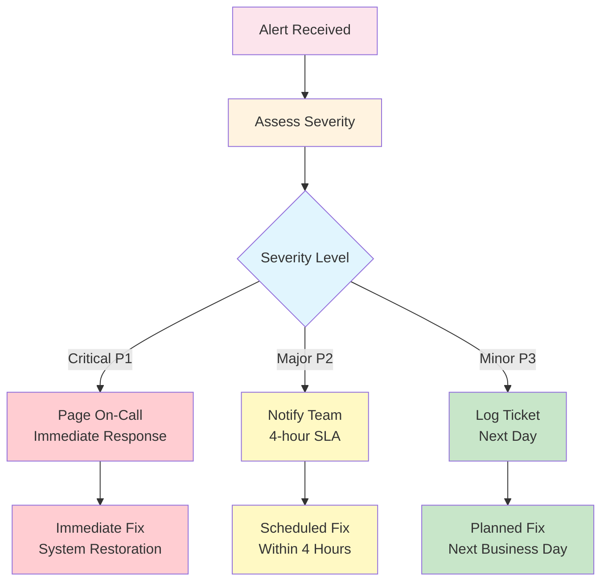

# The Farm Mark II - Operations Runbook

## 📋 Table of Contents
1. [System Health Checks](#system-health-checks)
2. [Common Operations](#common-operations)
3. [Incident Response](#incident-response)
4. [Maintenance Procedures](#maintenance-procedures)
5. [Performance Tuning](#performance-tuning)
6. [Disaster Recovery](#disaster-recovery)

## 🏥 System Health Checks

### Daily Health Check Procedure

```bash
#!/bin/bash
# Run this script daily to verify system health

echo "=== The Farm Mark II Daily Health Check ==="
date

# 1. Check API Gateway
echo "1. Checking API Gateway..."
curl -s https://REGION-PROJECT.cloudfunctions.net/api-gateway/health | jq '.'

# 2. Check Data Ingester
echo "2. Checking Data Ingester..."
kubectl get pods -n trading-agents -l app=unified-market-data-ingester
kubectl logs -n trading-agents -l app=unified-market-data-ingester --tail=10

# 3. Check Redis
echo "3. Checking Redis..."
gcloud redis instances describe redis-instance --region=us-central1 --format="value(state)"

# 4. Check BigQuery
echo "4. Checking BigQuery..."
bq query --use_legacy_sql=false 'SELECT COUNT(*) as count FROM fmel.trading_decisions WHERE DATE(created_at) = CURRENT_DATE()'

# 5. Check Pub/Sub
echo "5. Checking Pub/Sub..."
gcloud pubsub topics list --format="table(name,messageRetentionDuration)"
gcloud pubsub subscriptions list --format="table(name,ackDeadlineSeconds,messageRetentionDuration)"

echo "=== Health Check Complete ==="
```

### Critical Metrics to Monitor

| Metric | Normal Range | Alert Threshold | Action |
|--------|-------------|-----------------|--------|
| API Gateway Latency | < 100ms | > 500ms | Scale up instances |
| Redis Latency | < 10ms | > 50ms | Check network/memory |
| Data Ingester CPU | < 60% | > 80% | Scale horizontally |
| BigQuery Query Time | < 2s | > 10s | Optimize queries |
| Pub/Sub Backlog | < 1000 | > 10000 | Scale consumers |
| Error Rate | < 0.1% | > 1% | Check logs |

## 🔧 Common Operations

### 1. Restart Data Ingester

```bash
# Graceful restart
kubectl rollout restart deployment/unified-market-data-ingester -n trading-agents

# Force restart (if stuck)
kubectl delete pods -n trading-agents -l app=unified-market-data-ingester
```

### 2. Clear Redis Cache

```bash
# Connect to Redis via proxy
kubectl run redis-cli --rm -i --tty \
  --image redis:alpine -- redis-cli -h $REDIS_HOST

# In Redis CLI:
FLUSHDB  # Clear current database
# or
DEL leaderboard:*  # Clear only leaderboard data
```

### 3. Update API Gateway

```bash
cd cloud-functions/api-gateway

# Test locally first
npm test

# Deploy new version
gcloud functions deploy api-gateway \
  --source=. \
  --region=us-central1 \
  --entry-point=app

# Verify deployment
curl https://REGION-PROJECT.cloudfunctions.net/api-gateway/health
```

### 4. Scale Paper Trading Pods

```bash
# View current replicas
kubectl get deployment -n trading-agents

# Scale up for high load
kubectl scale deployment paper-trader --replicas=10 -n trading-agents

# Scale down during off-hours
kubectl scale deployment paper-trader --replicas=2 -n trading-agents
```

### 5. Emergency Stop Trading

```bash
# Stop all paper trading immediately
kubectl scale deployment paper-trader --replicas=0 -n trading-agents

# Stop data ingestion
kubectl scale deployment unified-market-data-ingester --replicas=0 -n trading-agents

# Notify users
echo "Trading halted at $(date)" | \
  gcloud pubsub topics publish system-alerts --message-stdin
```

## 🚨 Incident Response

### Incident Response Flowchart



### P1: System Down Procedures

```bash
#!/bin/bash
# P1 Incident Response Script

# 1. Verify the issue
echo "Checking system status..."
curl -f https://API_URL/health || echo "API Gateway is DOWN"

# 2. Check recent deployments
gcloud functions describe api-gateway --region=us-central1 \
  --format="value(updateTime)"

# 3. Rollback if needed
gcloud functions deploy api-gateway \
  --source=gs://backup/last-known-good.zip \
  --region=us-central1

# 4. Notify stakeholders
gcloud pubsub topics publish incident-notifications \
  --message="P1 Incident: System recovery in progress"

# 5. Document in incident log
echo "$(date): P1 incident - API Gateway failure" >> incidents.log
```

### P2: Performance Degradation

```bash
# Identify bottlenecks
kubectl top pods -n trading-agents
gcloud monitoring dashboards list

# Scale resources
kubectl scale deployment unified-market-data-ingester --replicas=5 -n trading-agents
gcloud functions deploy api-gateway --max-instances=200 --region=us-central1

# Clear caches if needed
# (Redis cache clear commands as shown above)
```

### P3: Non-Critical Issues

```bash
# Log the issue
echo "$(date): P3 - $ISSUE_DESCRIPTION" >> operations.log

# Create tracking ticket
gcloud issue-tracker create \
  --title="P3: $ISSUE_TITLE" \
  --priority=low
```

## 🛠️ Maintenance Procedures

### Weekly Maintenance Window

**Schedule: Sundays 2:00 AM - 4:00 AM UTC**

```bash
#!/bin/bash
# Weekly maintenance script

echo "Starting weekly maintenance - $(date)"

# 1. Backup critical data
bq extract --destination_format=AVRO \
  fmel.trading_decisions \
  gs://backups/fmel/trading_decisions_$(date +%Y%m%d)/*

# 2. Clean old data (>30 days)
bq query --use_legacy_sql=false \
  "DELETE FROM market_data.bars WHERE DATE(timestamp) < DATE_SUB(CURRENT_DATE(), INTERVAL 30 DAY)"

# 3. Update dependencies
cd cloud-functions/api-gateway
npm update
npm audit fix

# 4. Rotate secrets
kubectl delete secret alpaca-credentials -n trading-agents
kubectl create secret generic alpaca-credentials \
  --from-literal=ALPACA_API_KEY=$NEW_KEY \
  --from-literal=ALPACA_SECRET_KEY=$NEW_SECRET \
  -n trading-agents

# 5. System health check
bash daily-health-check.sh

echo "Weekly maintenance complete - $(date)"
```

### Monthly Tasks

1. **Security Audit**
```bash
# Run security scan
gcloud alpha container images scan IMAGE_URL

# Review IAM permissions
gcloud projects get-iam-policy $PROJECT_ID

# Check for unused resources
gcloud compute instances list --filter="status:TERMINATED"
```

2. **Cost Optimization**
```bash
# Generate cost report
gcloud billing budgets list

# Identify expensive queries
bq show --format=prettyjson --job JOB_ID

# Review autoscaling metrics
kubectl describe hpa -n trading-agents
```

## 🚀 Performance Tuning

### Database Optimization

```sql
-- Add indexes for common queries
CREATE INDEX idx_agent_timestamp ON fmel.trading_decisions(agent_id, created_at DESC);
CREATE INDEX idx_user_performance ON fmel.trading_decisions(user_id, portfolio_value);

-- Partition tables by date
ALTER TABLE market_data.bars
ADD PARTITION BY DATE(timestamp);
```

### Redis Optimization

```redis
# Configure memory policy
CONFIG SET maxmemory-policy allkeys-lru
CONFIG SET maxmemory 2gb

# Enable persistence
CONFIG SET save "900 1 300 10 60 10000"
BGSAVE
```

### Kubernetes Optimization

```yaml
# Update resource limits in deployment
apiVersion: apps/v1
kind: Deployment
spec:
  template:
    spec:
      containers:
      - name: ingester
        resources:
          requests:
            memory: "512Mi"
            cpu: "250m"
          limits:
            memory: "1Gi"
            cpu: "500m"
```

## 🔥 Disaster Recovery

### Backup Strategy

| Component | Backup Frequency | Retention | Location |
|-----------|-----------------|-----------|----------|
| BigQuery | Daily | 30 days | GCS |
| Firestore | Daily | 7 days | GCS |
| Code | On deployment | Forever | Git + GCS |
| Configs | Daily | 30 days | GCS |
| Secrets | On change | 90 days | Secret Manager |

### Recovery Procedures

#### 1. Complete System Recovery

```bash
#!/bin/bash
# Full system recovery from backup

# 1. Restore Terraform state
gsutil cp gs://terraform-state/backup/terraform.tfstate .
terraform init
terraform apply

# 2. Restore BigQuery data
bq load --source_format=AVRO \
  fmel.trading_decisions \
  gs://backups/fmel/trading_decisions_YYYYMMDD/*

# 3. Restore Firestore
gcloud firestore import gs://backups/firestore/YYYYMMDD

# 4. Redeploy services
bash scripts/deployment/deploy.sh

# 5. Verify system health
bash scripts/utilities/verify-system.sh
```

#### 2. Regional Failover

```bash
# Switch to backup region
export BACKUP_REGION=us-east1

# Update DNS
gcloud dns record-sets transaction start --zone=spookylabs
gcloud dns record-sets transaction add \
  --name=api.spookylabs.com \
  --type=A \
  --ttl=300 \
  --zone=spookylabs \
  --rrdatas=BACKUP_IP
gcloud dns record-sets transaction execute --zone=spookylabs

# Deploy to backup region
gcloud functions deploy api-gateway \
  --region=$BACKUP_REGION \
  --source=.
```

### RTO/RPO Targets

| Scenario | RTO (Recovery Time) | RPO (Data Loss) |
|----------|-------------------|-----------------|
| API Gateway failure | 5 minutes | 0 minutes |
| Data Ingester failure | 10 minutes | 1 minute |
| Redis failure | 15 minutes | 5 minutes |
| Complete region failure | 1 hour | 15 minutes |
| Complete system failure | 4 hours | 1 hour |

## 📊 Monitoring & Alerting

### Overview

All monitoring resources are managed via Terraform in `terraform/main.tf`. Monitoring includes:
- **1 Dashboard** (always created) with 6 widgets
- **4 Alert Policies** (optional, requires `alert_email` in terraform.tfvars)
- **1 Notification Channel** (email, when alerts enabled)

### Access Monitoring Dashboard

```bash
# Get dashboard URL from Terraform
cd terraform
terraform output monitoring_dashboard_url

# Or visit Cloud Console
open https://console.cloud.google.com/monitoring/dashboards
```

**Dashboard widgets include:**
1. **Cloud Functions** - Request count, error rate, latency
2. **GKE Cluster** - CPU usage, memory usage, pod count
3. **Redis** - Operations/sec, memory usage, latency
4. **BigQuery** - Bytes processed, query count, slot usage
5. **Pub/Sub** - Message count, backlog, publish latency
6. **Paper Trading** - Active agents, order rate, P&L

### Enable Alert Policies

Alert policies are **optional** and only created when you set `alert_email` in `terraform/terraform.tfvars`:

```hcl
# terraform/terraform.tfvars
alert_email = "alerts@example.com"
```

Then apply:
```bash
cd terraform
terraform apply
```

**Alert policies created:**
1. **High Error Rate** - Cloud Functions error rate >5% for 5 minutes
2. **GKE High CPU** - Node CPU usage >80% for 5 minutes
3. **BigQuery High Slot Usage** - Slot usage >1000 for 10 minutes
4. **Paper Trading Pod Failures** - >3 pod restarts in 10 minutes

### FMEL-Specific Monitoring

**Check FMEL decision recording:**
```bash
# Count decisions recorded today
bq query --use_legacy_sql=false \
  "SELECT COUNT(*) as decisions_today,
          MAX(timestamp) as last_recorded
   FROM fmel.trading_decisions
   WHERE DATE(timestamp) = CURRENT_DATE()"

# Check for gaps in recording (should be continuous)
bq query --use_legacy_sql=false \
  "SELECT agent_id,
          TIMESTAMP_DIFF(MAX(timestamp), MIN(timestamp), MINUTE) as minutes_active,
          COUNT(*) as total_decisions
   FROM fmel.trading_decisions
   WHERE DATE(timestamp) = CURRENT_DATE()
   GROUP BY agent_id"
```

**Check FMEL health programmatically:**
```python
from spooky_fmel import FMELRecorder

# Get FMEL status (if running in paper trader)
status = recorder.get_health()
# Returns: {
#   'decisions_recorded': 1234,
#   'decisions_uploaded': 1234,
#   'errors': 0,
#   'last_upload': '2025-09-30T10:00:00Z',
#   'mode': 'PAPER'
# }
```

### Monitoring Best Practices

**Daily checks:**
- Review dashboard for anomalies (5 minutes)
- Check error rates and latencies
- Verify FMEL recording is continuous
- Review cost trends

**Weekly checks:**
- Analyze performance trends over 7 days
- Review alert history and false positives
- Check for resource waste (unused instances, etc.)
- Validate backup completion

**Monthly checks:**
- Comprehensive cost analysis
- Security audit of monitoring data access
- Review and update alert thresholds
- Test incident response procedures

### Custom Metrics

**Add custom metrics to your code:**
```python
# In your trading strategy
from google.cloud import monitoring_v3

client = monitoring_v3.MetricServiceClient()
project_name = f"projects/{project_id}"

# Record custom metric
series = monitoring_v3.TimeSeries()
series.metric.type = "custom.googleapis.com/trading/order_execution_time"
series.resource.type = "global"
# ... add point data
client.create_time_series(name=project_name, time_series=[series])
```

**Query custom metrics:**
```bash
gcloud monitoring time-series list \
  --filter='metric.type="custom.googleapis.com/trading/*"' \
  --format=json
```

### Alert Notification Channels

**List configured channels:**
```bash
gcloud alpha monitoring channels list
```

**Add additional notification channels (Slack, PagerDuty, etc.):**
```bash
# Via Cloud Console (recommended)
open https://console.cloud.google.com/monitoring/alerting/notifications

# Or via Terraform - add to terraform/main.tf:
resource "google_monitoring_notification_channel" "slack" {
  display_name = "Slack Alerts"
  type         = "slack"
  labels = {
    channel_name = "#alerts"
  }
}
```

### Monitoring Costs

**Estimated monitoring costs:**
- Dashboard: Free (included in GCP)
- Alert policies: Free (up to 500)
- Custom metrics: $0.258 per metric/month (first 150 free)
- Log ingestion: $0.50/GB (first 50GB/month free)

**Optimize monitoring costs:**
- Use sampling for high-volume metrics
- Set appropriate retention periods
- Use Cloud Logging filters to reduce ingestion
- Delete unused custom metrics

### Troubleshooting Monitoring

**Issue: No data in dashboard**
```bash
# Check if monitoring API is enabled
gcloud services list --enabled | grep monitoring

# Enable if needed
gcloud services enable monitoring.googleapis.com
```

**Issue: Alerts not firing**
```bash
# Check alert policy status
gcloud alpha monitoring policies list

# Check notification channel
gcloud alpha monitoring channels describe CHANNEL_ID

# Test notification channel
gcloud alpha monitoring channels test CHANNEL_ID
```

**Issue: High monitoring costs**
```bash
# Identify expensive metrics
gcloud logging read "resource.type=monitoring" \
  --limit=100 --format=json | \
  jq '.[] | select(.jsonPayload.cost > 10)'

# Review custom metrics
gcloud monitoring metric-descriptors list \
  --filter='metric.type=starts_with("custom.googleapis.com")'
```

## 📝 Operational Checklists

### Pre-Deployment Checklist
- [ ] Run all tests locally
- [ ] Review code changes
- [ ] Update documentation
- [ ] Backup current version
- [ ] Notify team of deployment
- [ ] Verify rollback procedure

### Post-Deployment Checklist
- [ ] Verify health endpoints
- [ ] Check error rates
- [ ] Monitor performance metrics
- [ ] Test critical user flows
- [ ] Update deployment log
- [ ] Close deployment ticket

### End of Day Checklist
- [ ] Review daily metrics
- [ ] Check for alerts
- [ ] Verify backups completed
- [ ] Review tomorrow's schedule
- [ ] Update team on any issues

## 🆘 Emergency Contacts

| Role | Name | Phone | Email |
|------|------|-------|-------|
| On-Call Engineer | Rotation | +1-555-0911 | oncall@spookylabs.com |
| Platform Lead | John Smith | +1-555-0100 | john@spookylabs.com |
| VP Engineering | Jane Doe | +1-555-0101 | jane@spookylabs.com |
| Google Cloud Support | - | 1-844-613-7589 | - |

## 📚 Additional Resources

- [Architecture Documentation](../architecture/ARCHITECTURE.md)
- [Deployment Guide](../deployment/DEPLOYMENT.md)
- [API Documentation](../reference/ENDPOINTS.md)
- [Security Guide](SECURITY.md)
- [Google Cloud Console](https://console.cloud.google.com)
- [Kubernetes Dashboard](kubectl proxy & http://localhost:8001/ui)

---
Last Updated: 2025-09-29
Version: 1.0