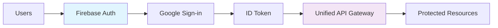
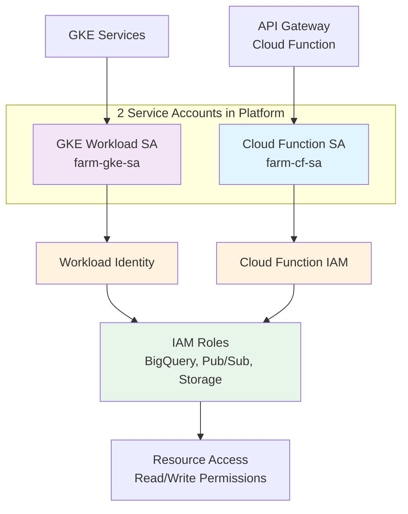

# Security Model Documentation

## Overview

Spooky Labs implements defense-in-depth security with multiple layers of protection for user data, agent code, and trading operations. This document outlines our security architecture and practices.

## Security Principles

1. **Least Privilege**: Every component has minimal required permissions
2. **Zero Trust**: Verify everything, trust nothing
3. **Defense in Depth**: Multiple security layers
4. **Encryption Everywhere**: Data encrypted at rest and in transit
5. **Audit Everything**: Comprehensive logging and monitoring

## Authentication & Authorization

### User Authentication


**Implementation:**
- Firebase Authentication with Google OAuth 2.0
- JWT tokens with 1-hour expiration
- Refresh tokens stored securely
- Session management in Firebase

### Service Authentication



**Service Accounts:**
```python
# Minimal permissions per service
service_accounts = {
    'cloud-build-backtest': [
        'storage.objectViewer',     # Read agent code
        'bigquery.dataEditor',      # Write FMEL records
        'logging.logWriter'         # Write build logs
    ],
    'paper-trading-k8s': [
        'secretmanager.secretAccessor',  # Access Alpaca keys
        'bigquery.dataEditor',            # Stream FMEL records
        'pubsub.publisher'                # Publish events
    ],
    'cloud-functions': [
        'cloudbuild.builds.create', # Trigger backtests
        'container.developer',      # Deploy to K8s
        'firestore.dataEditor'      # Update metadata
    ],
    'data-ingestion': [
        'pubsub.publisher',         # Publish data
        'bigquery.dataEditor'       # Write Alpaca/news data
    ]
}
```

### API Authorization

Every API request requires:
1. Valid Firebase ID token
2. User owns the resource
3. Action is permitted

```python
def authorize_request(request, resource):
    # Verify token
    token = request.headers['Authorization']
    user = auth.verify_id_token(token)

    # Check ownership
    if resource.owner_id != user.uid:
        raise Unauthorized()

    # Check permissions
    if not has_permission(user, resource, action):
        raise Forbidden()
```

## Network Security

### VPC Configuration
```yaml
Network Architecture:
  VPC: Custom VPC with private subnets
  Subnets:
    - Cluster: 10.0.0.0/20 (private)
    - Pods: 10.4.0.0/14 (private)
    - Services: 10.8.0.0/20 (private)
  NAT: Cloud NAT for outbound traffic
  Firewall: Deny all inbound, selective outbound
```

### Network Policies

```yaml
# Pod isolation in Kubernetes
apiVersion: networking.k8s.io/v1
kind: NetworkPolicy
metadata:
  name: agent-isolation
spec:
  podSelector:
    matchLabels:
      app: trading-agent
  policyTypes:
  - Ingress
  - Egress
  ingress: []  # No inbound
  egress:
  - to:
    - namespaceSelector:
        matchLabels:
          name: data-platform
    ports:
    - protocol: TCP
      port: 443  # HTTPS only
```

## Data Security

### Encryption at Rest
- **Cloud Storage**: AES-256 encryption (Google-managed keys)
- **BigQuery**: Automatic encryption
- **Firestore**: Encrypted by default
- **Persistent Volumes**: Encrypted disks

### Encryption in Transit
- **External**: TLS 1.3 minimum
- **Internal**: mTLS between services
- **API Calls**: HTTPS only
- **Data Streaming**: Encrypted Pub/Sub

### Data Classification

| Level | Description | Storage | Access |
|-------|------------|---------|---------|
| Public | Leaderboards, rankings | Firestore | Anyone |
| Private | User data, agents | Firebase | Owner only |
| Sensitive | Trading decisions | BigQuery | Authorized services |
| Critical | API keys, credentials | Secret Manager | Service accounts |

## Agent Code Security

### Code Validation

```python
def validate_agent_code(code):
    # 1. Syntax check
    try:
        ast.parse(code)
    except SyntaxError:
        raise InvalidCode()

    # 2. Import restrictions
    blocked_imports = ['os', 'subprocess', 'socket', 'requests']
    for import in find_imports(code):
        if import in blocked_imports:
            raise ForbiddenImport(import)

    # 3. Size limits
    if len(code) > 1_000_000:  # 1MB limit
        raise CodeTooLarge()

    return True
```

### Runtime Sandboxing

#### Cloud Build (Backtesting)
```yaml
# Isolated container execution
options:
  machineType: 'N1_STANDARD_1'
  diskSizeGb: 10
  substitutionOption: 'ALLOW_LOOSE'
  logging: CLOUD_LOGGING_ONLY
  pool:
    name: 'private-pool'  # Optional: private worker pool
```

#### Kubernetes (Paper Trading)
```yaml
# Pod security context
securityContext:
  runAsNonRoot: true
  runAsUser: 1000
  readOnlyRootFilesystem: true
  allowPrivilegeEscalation: false
  capabilities:
    drop:
    - ALL
```

### Resource Limits

```yaml
resources:
  limits:
    cpu: "2"
    memory: "4Gi"
    ephemeral-storage: "5Gi"
  requests:
    cpu: "500m"
    memory: "1Gi"
```

## Secrets Management

### Secret Storage
- **Google Secret Manager**: API keys, credentials
- **Kubernetes Secrets**: Runtime configuration
- **Firebase Config**: Client-side settings

### Secret Rotation
```bash
# Automated rotation every 90 days
gcloud scheduler jobs create http rotate-secrets \
  --schedule="0 0 1 */3 *" \
  --uri="https://rotate-secrets.run.app"
```

### Access Control
```python
# Only specific services can access secrets
secret_permissions = {
    'alpaca-api-key': ['paper-trading-k8s', 'data-ingestion'],
    'news-api-key': ['data-ingestion'],
    'firebase-admin': ['cloud-functions'],
    'bigquery-key': ['cloud-build-backtest', 'paper-trading-k8s']
}
```

## Compliance & Auditing

### Audit Logging

All actions are logged:
```json
{
  "timestamp": "2024-01-15T10:30:00Z",
  "user_id": "user-123",
  "action": "submit_agent",
  "resource": "agent-456",
  "ip_address": "192.168.1.1",
  "user_agent": "Mozilla/5.0...",
  "result": "success"
}
```

### Regulatory Compliance

**FINRA Rule 3110**: Supervisory system for algorithmic trading
- FMEL provides complete decision recording (no scoring)
- Every next() call captured with full state
- 7-year retention policy for compliance

**SEC Market Access Rule**: Risk management controls
- Position limits enforced
- Rate limiting on orders
- Pre-trade risk checks

**GDPR/CCPA**: Data privacy
- User data deletion on request
- Data portability APIs
- Privacy policy compliance

### WORM Storage

```python
# Compliance archive with retention lock
def archive_for_compliance(data):
    blob = worm_bucket.blob(f"archive/{uuid.uuid4()}")
    blob.upload_from_string(json.dumps(data))

    # Set retention lock (7 years)
    blob.retention.mode = 'Locked'
    blob.retention.retain_until = datetime.now() + timedelta(days=2555)
    blob.patch()
```

## Access Control

### IAM Hierarchy

```
Organization
  └── Project (spooky-labs)
      ├── Owner: Admin team
      ├── Editor: DevOps team
      ├── Viewer: Support team
      └── Custom Roles:
          ├── Cloud Build Executor (backtesting)
          ├── K8s Deployer (paper trading)
          ├── Data Analyst (read-only BigQuery)
          └── FMEL Reader (access decision records)
```

### RBAC in Kubernetes

```yaml
apiVersion: rbac.authorization.k8s.io/v1
kind: Role
metadata:
  name: agent-runtime-role
rules:
- apiGroups: [""]
  resources: ["pods", "services"]
  verbs: ["get", "list", "create"]
- apiGroups: ["batch"]
  resources: ["jobs"]
  verbs: ["create", "delete"]
```

## Incident Response

### Security Monitoring

**Real-time Alerts:**
- Failed authentication attempts > 5/minute
- Unusual data access patterns
- Resource limit violations
- Network policy violations

**Daily Reports:**
- Security scan results
- Access audit summary
- Vulnerability assessment
- Cost anomalies

### Incident Procedure

1. **Detection**: Automated alerts trigger
2. **Assessment**: Severity classification
3. **Containment**: Isolate affected systems
4. **Eradication**: Remove threat
5. **Recovery**: Restore normal operations
6. **Lessons Learned**: Post-mortem analysis

### Contact

Security issues: security@spookylabs.com
Bug bounty: bugbounty.spookylabs.com

## Security Checklist

### Development
- [ ] Code review required
- [ ] Security scanning passed
- [ ] No secrets in code
- [ ] Dependencies updated

### Deployment
- [ ] TLS certificates valid
- [ ] Firewall rules configured
- [ ] IAM roles assigned
- [ ] Secrets rotated

### Operations
- [ ] Monitoring enabled
- [ ] Backups verified
- [ ] Logs retained
- [ ] Audits scheduled

## Vulnerability Management

### Scanning

```bash
# Container scanning
gcloud container images scan IMAGE_URL

# Dependency scanning
pip-audit requirements.txt

# Infrastructure scanning
terraform plan -var="enable_security_scan=true"
```

### Patching Schedule

- **Critical**: Within 24 hours
- **High**: Within 7 days
- **Medium**: Within 30 days
- **Low**: Next release cycle

## Data Privacy

### User Rights

1. **Right to Access**: Export all user data
2. **Right to Delete**: Remove all records
3. **Right to Portability**: Standard formats
4. **Right to Correction**: Update information

### Data Minimization

- Only collect necessary data
- Automatic deletion policies
- Anonymous analytics
- No PII in logs

## Third-Party Security

### Vendor Assessment

All third-party services must:
- SOC 2 Type II certification
- Encryption at rest/transit
- GDPR compliance
- Security audit access

### Current Vendors

| Service | Purpose | Security |
|---------|---------|----------|
| Google Cloud | Infrastructure | ISO 27001 |
| Firebase | Authentication | SOC 2 |
| Alpaca | Market Data | FINRA member |
| Stripe | Payments (future) | PCI DSS |

## Security Training

### Developer Requirements

- Annual security training
- Secure coding practices
- OWASP Top 10 awareness
- Incident response drills

### Security Champions

Each team has a security champion:
- Extra security training
- Security review participation
- Threat modeling sessions
- Security tool expertise

## Future Enhancements

### Planned Improvements

1. **Hardware Security Keys**: For admin accounts
2. **Bug Bounty Program**: Public vulnerability disclosure
3. **Penetration Testing**: Quarterly assessments
4. **Zero Trust Network**: Microsegmentation
5. **SIEM Integration**: Advanced threat detection