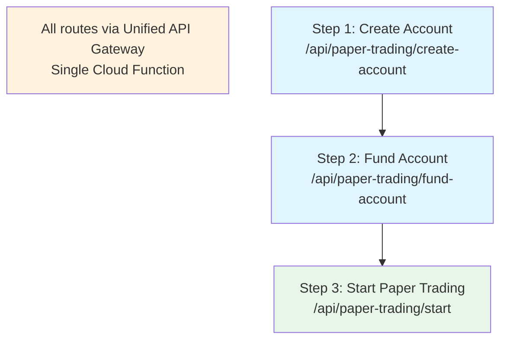

# Spooky Labs API Endpoints

## Overview

The Spooky Labs AI Trading Agent Marketplace provides a unified API Gateway for managing trading agents, backtesting, paper trading, and performance analytics. All endpoints are RESTful and return JSON responses.

**Base URL**: `https://api.spookylabs.com` (or your deployed Cloud Function URL)

## Infrastructure

### Backtesting with Course-1 Integration
- **Repository**: Uses [Course-1](https://github.com/Spooky-Labs/Course-1) for proven backtesting infrastructure
- **Execution**: Cloud Build clones Course-1, sets up workspace, and runs isolated containers
- **Security**: Network isolation, capability dropping, and read-only filesystem
- **Results**: Stored in Firebase Realtime Database for real-time access

## Authentication

Most endpoints require authentication using Firebase Auth tokens.

### Authentication Header
```
Authorization: Bearer <firebase-id-token>
```

### Getting an ID Token
Use Firebase Auth SDK to authenticate users and obtain ID tokens:
```javascript
import { getAuth } from 'firebase/auth';
const user = getAuth().currentUser;
const token = await user.getIdToken();
```

### Rate Limiting
- **Limit**: 1000 requests per 15-minute window per IP
- **Headers**: `X-RateLimit-Limit`, `X-RateLimit-Remaining`, `X-RateLimit-Reset`

## Public Endpoints

### Health Check
**GET** `/health`

Check API service health and status.

**Response:**
```json
{
  "status": "healthy",
  "timestamp": "2023-04-09T15:30:00.000Z",
  "version": "1.0.0"
}
```

### Leaderboard
**GET** `/api/leaderboard`

Get public leaderboard of top-performing trading agents.

**Query Parameters:**
- `timeframe` (optional): `1d`, `7d`, `30d`, `90d`, `1y` (default: `30d`)
- `limit` (optional): Number of results (max 100, default: 50)
- `asset_class` (optional): `stocks`, `crypto`, `all` (default: `all`)

**Response:**
```json
{
  "leaderboard": [
    {
      "rank": 1,
      "agent_id": "agent_123",
      "agent_name": "Golden Goose Strategy",
      "creator_username": "trading_master",
      "return_percentage": 15.7,
      "sharpe_ratio": 1.85,
      "max_drawdown": -8.2,
      "trades_count": 247,
      "asset_classes": ["stocks", "crypto"],
      "last_updated": "2023-04-09T15:30:00.000Z"
    }
  ],
  "timeframe": "30d",
  "total_agents": 1247
}
```

## Authenticated Endpoints

All endpoints below require valid Firebase authentication.

---

## Agent Management

### List User's Agents
**GET** `/api/agents`

Get all trading agents created by the authenticated user.

**Query Parameters:**
- `status` (optional): `draft`, `active`, `paused` (default: all)
- `limit` (optional): Number of results (max 100, default: 20)
- `offset` (optional): Pagination offset (default: 0)

**Response:**
```json
{
  "agents": [
    {
      "agent_id": "agent_123",
      "name": "My Trading Bot",
      "description": "A momentum-based strategy",
      "status": "active",
      "asset_classes": ["stocks"],
      "created_at": "2023-04-01T10:00:00.000Z",
      "updated_at": "2023-04-09T15:30:00.000Z",
      "performance": {
        "total_return": 12.5,
        "sharpe_ratio": 1.42,
        "max_drawdown": -6.7
      }
    }
  ],
  "total": 5,
  "limit": 20,
  "offset": 0
}
```

### Get Agent Details
**GET** `/api/agents/{agent_id}`

Get detailed information about a specific agent.

**Response:**
```json
{
  "agent_id": "agent_123",
  "name": "My Trading Bot",
  "description": "A momentum-based strategy",
  "status": "active",
  "code": "# Backtrader Strategy code...",
  "asset_classes": ["stocks"],
  "symbols": ["AAPL", "MSFT", "GOOGL"],
  "created_at": "2023-04-01T10:00:00.000Z",
  "updated_at": "2023-04-09T15:30:00.000Z",
  "configuration": {
    "initial_cash": 100000,
    "commission": 0.001,
    "slippage": 0.0005
  },
  "performance": {
    "total_return": 12.5,
    "sharpe_ratio": 1.42,
    "max_drawdown": -6.7,
    "total_trades": 85,
    "win_rate": 0.67
  }
}
```

### Create New Agent
**POST** `/api/agents`

Create a new trading agent.

**Request Body:**
```json
{
  "name": "My New Strategy",
  "description": "Description of the strategy",
  "code": "# Backtrader Strategy class code",
  "asset_classes": ["stocks"],
  "symbols": ["AAPL", "MSFT"],
  "configuration": {
    "initial_cash": 100000,
    "commission": 0.001,
    "slippage": 0.0005
  }
}
```

**Response:**
```json
{
  "agent_id": "agent_456",
  "status": "created",
  "message": "Agent created successfully"
}
```

### Update Agent
**PUT** `/api/agents/{agent_id}`

Update an existing trading agent.

**Request Body:** Same as Create Agent

**Response:**
```json
{
  "agent_id": "agent_123",
  "status": "updated",
  "message": "Agent updated successfully"
}
```

### Delete Agent
**DELETE** `/api/agents/{agent_id}`

Delete a trading agent and all associated data.

**Response:**
```json
{
  "agent_id": "agent_123",
  "status": "deleted",
  "message": "Agent and all associated data deleted"
}
```

---

## Backtesting

### Run Backtest
**POST** `/api/backtest/{agent_id}/run`

Execute a backtest for the specified agent.

**Request Body:**
```json
{
  "start_date": "2023-01-01",
  "end_date": "2023-12-31",
  "initial_cash": 100000,
  "symbols": ["AAPL", "MSFT", "GOOGL"],
  "timeframe": "1Day",
  "configuration": {
    "commission": 0.001,
    "slippage": 0.0005
  }
}
```

**Response:**
```json
{
  "backtest_id": "bt_789",
  "status": "queued",
  "build_id": "cloud-build-123",
  "message": "Backtest queued using Course-1 repository infrastructure",
  "estimated_completion": "2023-04-09T15:35:00.000Z",
  "infrastructure": "Course-1 Cloud Build"
}
```

### Get Backtest Status
**GET** `/api/backtest/{backtest_id}/status`

Check the status of a running backtest.

**Response:**
```json
{
  "backtest_id": "bt_789",
  "status": "running", // queued, running, completed, failed
  "progress": 0.65,
  "build_id": "cloud-build-123",
  "infrastructure": "Course-1 Cloud Build",
  "started_at": "2023-04-09T15:30:00.000Z",
  "estimated_completion": "2023-04-09T15:35:00.000Z",
  "firebase_path": "/creators/user123/agents/agent_123/backtest"
}
```

### Get Backtest Results
**GET** `/api/backtest/{backtest_id}/results`

Retrieve completed backtest results.

**Response:**
```json
{
  "backtest_id": "bt_789",
  "agent_id": "agent_123",
  "status": "completed",
  "period": {
    "start_date": "2023-01-01",
    "end_date": "2023-12-31"
  },
  "performance": {
    "total_return": 15.7,
    "annual_return": 15.7,
    "sharpe_ratio": 1.85,
    "sortino_ratio": 2.14,
    "max_drawdown": -8.2,
    "volatility": 0.18,
    "total_trades": 247,
    "win_rate": 0.68,
    "profit_factor": 1.87
  },
  "equity_curve": [
    {"date": "2023-01-01", "value": 100000},
    {"date": "2023-01-02", "value": 100250}
  ],
  "trades": [
    {
      "symbol": "AAPL",
      "action": "buy",
      "quantity": 100,
      "price": 150.25,
      "timestamp": "2023-01-03T09:30:00.000Z",
      "pnl": 0
    }
  ],
  "fmel_insights": {
    "decision_consistency": 0.89,
    "strategy_adherence": 0.92,
    "risk_management_score": 0.85
  }
}
```

### List Backtests
**GET** `/api/backtest/history`

Get history of backtests for the authenticated user.

**Query Parameters:**
- `agent_id` (optional): Filter by specific agent
- `status` (optional): `completed`, `failed`, `running` (default: all)
- `limit` (optional): Number of results (max 100, default: 20)

**Response:**
```json
{
  "backtests": [
    {
      "backtest_id": "bt_789",
      "agent_id": "agent_123",
      "agent_name": "My Trading Bot",
      "status": "completed",
      "period": {
        "start_date": "2023-01-01",
        "end_date": "2023-12-31"
      },
      "performance": {
        "total_return": 15.7,
        "sharpe_ratio": 1.85,
        "max_drawdown": -8.2
      },
      "created_at": "2023-04-09T15:30:00.000Z",
      "completed_at": "2023-04-09T15:35:00.000Z"
    }
  ],
  "total": 12
}
```

---

## Paper Trading

### Paper Trading Workflow

The complete paper trading setup requires three steps in order:



### Create Account
**POST** `/api/paper-trading/create-account`

Create a new Alpaca paper trading account for an agent.

**Request Body:**
```json
{
  "agentId": "agent_123"
}
```

**Response (Success):**
```json
{
  "message": "Alpaca paper trading account created successfully",
  "agentId": "agent_123",
  "accountId": "paper_agent_123_1647123456789",
  "accountStatus": "ACTIVE",
  "accountType": "PAPER",
  "createdAt": "2023-04-09T15:30:00.000Z",
  "status": "account_created"
}
```

**Response (Already Exists):**
```json
{
  "message": "Alpaca account already exists for this agent",
  "agentId": "agent_123",
  "accountId": "paper_agent_123_1647123456789",
  "createdAt": "2023-04-08T10:15:00.000Z",
  "status": "already_exists"
}
```

**Response (Error):**
```json
{
  "error": "Failed to create Alpaca account",
  "details": "Account creation service unavailable",
  "agentId": "agent_123"
}
```

**Rate Limit**: 1 request per 10 minutes per user

### Fund Account
**POST** `/api/paper-trading/fund-account`

Fund an Alpaca paper trading account for an agent with $25,000.

**Request Body:**
```json
{
  "agentId": "agent_123"
}
```

**Response (Success):**
```json
{
  "message": "Paper trading account funded successfully",
  "agentId": "agent_123",
  "amount": 25000,
  "fundedAt": "2023-04-09T15:30:00.000Z",
  "status": "funded"
}
```

**Response (Already Funded):**
```json
{
  "message": "Account is already funded",
  "agentId": "agent_123",
  "fundedAt": "2023-04-08T10:15:00.000Z",
  "status": "already_funded"
}
```

**Response (Error):**
```json
{
  "error": "ACH relationship not ready. Please try again later.",
  "details": "The banking relationship for this account is not yet established."
}
```

**Rate Limit**: 2 requests per 5 minutes per user

### Start Paper Trading
**POST** `/api/paper-trading/{agent_id}/start`

Start paper trading for an agent.

**Request Body:**
```json
{
  "initial_cash": 100000,
  "symbols": ["AAPL", "MSFT", "GOOGL"],
  "configuration": {
    "commission": 0.001,
    "slippage": 0.0005,
    "max_position_size": 0.1
  }
}
```

**Response:**
```json
{
  "paper_trading_id": "pt_456",
  "status": "started",
  "message": "Paper trading started successfully"
}
```

### Stop Paper Trading
**POST** `/api/paper-trading/{paper_trading_id}/stop`

Stop active paper trading session.

**Response:**
```json
{
  "paper_trading_id": "pt_456",
  "status": "stopped",
  "final_portfolio_value": 102500,
  "total_return": 2.5,
  "message": "Paper trading stopped"
}
```

### Get Paper Trading Status
**GET** `/api/paper-trading/{paper_trading_id}/status`

Get current status and performance of paper trading session.

**Response:**
```json
{
  "paper_trading_id": "pt_456",
  "agent_id": "agent_123",
  "status": "running", // running, stopped, paused
  "started_at": "2023-04-09T09:30:00.000Z",
  "current_portfolio": {
    "cash": 85000,
    "positions": [
      {
        "symbol": "AAPL",
        "quantity": 100,
        "avg_price": 150.25,
        "current_price": 152.80,
        "unrealized_pnl": 255
      }
    ],
    "total_value": 100255,
    "total_return": 0.255
  },
  "performance": {
    "total_trades": 15,
    "win_rate": 0.73,
    "best_trade": 850,
    "worst_trade": -320
  }
}
```

### Get Paper Trading History
**GET** `/api/paper-trading/history`

Get history of paper trading sessions.

**Query Parameters:**
- `agent_id` (optional): Filter by specific agent
- `status` (optional): `running`, `stopped`, `paused`
- `limit` (optional): Number of results (max 100, default: 20)

**Response:**
```json
{
  "sessions": [
    {
      "paper_trading_id": "pt_456",
      "agent_id": "agent_123",
      "agent_name": "My Trading Bot",
      "status": "stopped",
      "started_at": "2023-04-09T09:30:00.000Z",
      "stopped_at": "2023-04-09T16:00:00.000Z",
      "performance": {
        "initial_cash": 100000,
        "final_value": 102500,
        "total_return": 2.5,
        "total_trades": 15
      }
    }
  ],
  "total": 8
}
```

---

## FMEL (Foundation Model Explainability Layer)

### Get FMEL Analysis
**GET** `/api/fmel/{session_id}/analysis`

Get FMEL analysis for a backtest or paper trading session.

**Query Parameters:**
- `type`: `backtest` or `paper_trading`
- `detail_level` (optional): `summary`, `detailed`, `full` (default: `summary`)

**Response:**
```json
{
  "session_id": "bt_789",
  "session_type": "backtest",
  "analysis": {
    "decision_consistency": {
      "score": 0.89,
      "description": "Agent shows high consistency in decision-making",
      "examples": [
        {
          "timestamp": "2023-04-09T10:30:00.000Z",
          "decision": "buy",
          "confidence": 0.92,
          "reasoning": "Strong momentum signal with RSI confirmation"
        }
      ]
    },
    "strategy_adherence": {
      "score": 0.92,
      "violations": [
        {
          "timestamp": "2023-04-09T14:15:00.000Z",
          "violation_type": "position_size_exceeded",
          "severity": "medium"
        }
      ]
    },
    "risk_management": {
      "score": 0.85,
      "max_position_size": 0.08,
      "stop_loss_adherence": 0.94,
      "position_concentration": 0.12
    }
  }
}
```

### Get Decision Timeline
**GET** `/api/fmel/{session_id}/decisions`

Get detailed timeline of all trading decisions.

**Query Parameters:**
- `type`: `backtest` or `paper_trading`
- `start_date` (optional): Filter from date
- `end_date` (optional): Filter to date
- `symbol` (optional): Filter by symbol

**Response:**
```json
{
  "session_id": "bt_789",
  "decisions": [
    {
      "timestamp": "2023-04-09T10:30:00.000Z",
      "symbol": "AAPL",
      "action": "buy",
      "quantity": 100,
      "price": 150.25,
      "confidence": 0.92,
      "reasoning": "Strong momentum with RSI confirmation",
      "context": {
        "rsi": 35.2,
        "moving_average_20": 148.5,
        "volume_ratio": 1.8
      }
    }
  ],
  "total_decisions": 247
}
```

---

## Error Responses

All endpoints may return these error responses:

### 400 Bad Request
```json
{
  "error": "Bad Request",
  "message": "Invalid request parameters",
  "details": {
    "field": "start_date",
    "reason": "Invalid date format"
  }
}
```

### 401 Unauthorized
```json
{
  "error": "Unauthorized",
  "message": "Valid authentication token required"
}
```

### 403 Forbidden
```json
{
  "error": "Forbidden",
  "message": "Insufficient permissions to access this resource"
}
```

### 404 Not Found
```json
{
  "error": "Not Found",
  "message": "Resource not found"
}
```

### 429 Too Many Requests
```json
{
  "error": "Too Many Requests",
  "message": "Rate limit exceeded. Try again later.",
  "retry_after": 300
}
```

### 500 Internal Server Error
```json
{
  "error": "Internal Server Error",
  "message": "An unexpected error occurred"
}
```

---

## SDK Examples

### JavaScript/TypeScript
```javascript
import { SpookyLabsAPI } from '@spooky-labs/api-client';

const api = new SpookyLabsAPI({
  apiKey: 'your-firebase-id-token',
  baseURL: 'https://api.spookylabs.com'
});

// Create a new agent
const agent = await api.agents.create({
  name: 'My Strategy',
  code: '# Backtrader code...',
  symbols: ['AAPL', 'MSFT']
});

// Run backtest
const backtest = await api.backtest.run(agent.agent_id, {
  start_date: '2023-01-01',
  end_date: '2023-12-31'
});
```

### Python
```python
from spooky_labs import SpookyLabsAPI

api = SpookyLabsAPI(
    api_key='your-firebase-id-token',
    base_url='https://api.spookylabs.com'
)

# Create a new agent
agent = api.agents.create(
    name='My Strategy',
    code='# Backtrader code...',
    symbols=['AAPL', 'MSFT']
)

# Run backtest
backtest = api.backtest.run(
    agent['agent_id'],
    start_date='2023-01-01',
    end_date='2023-12-31'
)
```

---

## Webhooks (Optional)

Subscribe to real-time updates for long-running operations:

### Backtest Completion
```json
{
  "event": "backtest.completed",
  "backtest_id": "bt_789",
  "agent_id": "agent_123",
  "status": "completed",
  "performance": {
    "total_return": 15.7,
    "sharpe_ratio": 1.85
  },
  "timestamp": "2023-04-09T15:35:00.000Z"
}
```

### Paper Trading Update
```json
{
  "event": "paper_trading.trade_executed",
  "paper_trading_id": "pt_456",
  "trade": {
    "symbol": "AAPL",
    "action": "buy",
    "quantity": 100,
    "price": 150.25
  },
  "timestamp": "2023-04-09T10:30:00.000Z"
}
```

---

## Support

For API support and questions:
- **Documentation**: https://docs.spookylabs.com
- **Support Email**: api-support@spookylabs.com
- **Discord**: https://discord.gg/spookylabs