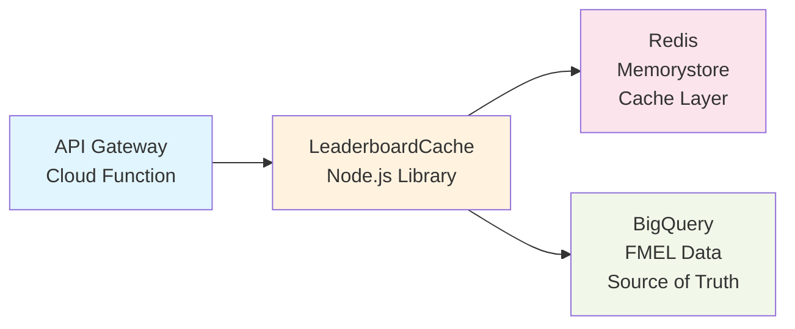

# Redis Leaderboard Implementation

**Purpose:** High-performance leaderboards using Memorystore (Redis) for sub-10ms query latency

## Architecture



**Benefits:**
- **Performance**: <10ms vs 1-3s (BigQuery)
- **Native sorted sets**: O(log N) for ranking operations
- **Cost**: $48/month (1GB Basic tier)

## Quick Start

**Prerequisites:**
- Terraform infrastructure deployed (includes Memorystore)
- API Gateway with VPC connector

### 1. Verify Redis Deployment

```bash
cd terraform
terraform output redis_host
# Output: 10.x.x.x (internal IP)

# Check status
gcloud redis instances describe redis-instance --region=us-central1
```

### 2. Enable Redis Route in API Gateway

```javascript
// cloud-functions/api-gateway/index.js
const leaderboardRoutes = require('./routes/leaderboard-redis');
app.use('/api/leaderboard', leaderboardRoutes);
```

### 3. Test Endpoints

```bash
# Get leaderboard
curl "https://REGION-PROJECT.cloudfunctions.net/api-gateway/api/leaderboard?mode=backtest&metric=total_pnl"

# Get agent rank
curl "https://REGION-PROJECT.cloudfunctions.net/api-gateway/api/leaderboard/agent/AGENT_ID?mode=backtest"
```

## Implementation Details

### LeaderboardCache Class

Located in `cloud-functions/api-gateway/lib/redis.js` and `cloud-functions/api-gateway/lib/bigquery.js`

**How it works:**
1. Check Redis cache (5min TTL)
2. If cache hit: return immediately (<10ms)
3. If cache miss: query BigQuery (1-3s)
4. Update Redis with results
5. Return data

**Redis keys:**
- `leaderboard:backtest:total_pnl:30d` - Backtest P&L leaderboard
- `leaderboard:backtest:sharpe_ratio:30d` - Backtest Sharpe leaderboard
- `leaderboard:paper:total_pnl:30d` - Paper trading leaderboard

**Data structure:** Redis sorted sets (ZADD, ZRANGE, ZREVRANK)

### Cache Refresh

**Automatic refresh** (every 5 minutes via Cloud Scheduler):
```bash
# Already configured in Terraform if needed
gcloud scheduler jobs create http refresh-leaderboards \
  --schedule="*/5 * * * *" \
  --uri="https://REGION-PROJECT.cloudfunctions.net/api-gateway/api/leaderboard/refresh" \
  --http-method=POST
```

**Manual refresh:**
```bash
curl -X POST "https://REGION-PROJECT.cloudfunctions.net/api-gateway/api/leaderboard/refresh"
```

## API Endpoints

### GET /api/leaderboard

Get ranked leaderboard

**Query params:**
- `mode` - `backtest` or `paper`
- `metric` - `total_pnl`, `sharpe_ratio`, `win_rate`
- `period` - `7d`, `30d`, `90d`, `all`
- `limit` - Max entries (default: 100)

**Response:**
```json
{
  "leaderboard": [
    {
      "rank": 1,
      "agent_id": "abc-123",
      "agent_name": "Alpha Strategy",
      "score": 15000.50,
      "metrics": {
        "total_trades": 150,
        "total_pnl": 15000.50,
        "sharpe_ratio": 1.85,
        "win_rate": 0.62
      }
    }
  ],
  "metadata": {
    "mode": "backtest",
    "metric": "total_pnl",
    "period": "30d",
    "source": "cache",
    "cached_at": "2025-09-30T10:00:00Z"
  }
}
```

### GET /api/leaderboard/agent/:id

Get specific agent's rank

**Response:**
```json
{
  "agent_id": "abc-123",
  "rank": 5,
  "score": 12500.00,
  "percentile": 95.2,
  "metrics": { ... }
}
```

### GET /api/leaderboard/stats

Platform statistics

**Response:**
```json
{
  "total_agents": 1250,
  "active_agents_24h": 450,
  "total_trades": 125000,
  "total_pnl": 1250000.50
}
```

## Monitoring

### Key Metrics

| Metric | Normal | Alert | Action |
|--------|--------|-------|--------|
| Cache Hit Rate | >90% | <80% | Increase cache TTL |
| Redis Latency | <10ms | >50ms | Check network/memory |
| Memory Usage | <80% | >90% | Increase Redis size |
| Connection Count | <50 | >100 | Check for leaks |

### Check Redis Status

```bash
# Via Cloud Console
open https://console.cloud.google.com/memorystore/redis/instances

# Via gcloud
gcloud redis instances describe redis-instance \
  --region=us-central1 \
  --format="table(state,currentLocationId,memorySizeGb,host,port)"
```

### Debug Cache

```bash
# Connect to Redis via Cloud Shell
gcloud compute ssh redis-proxy --zone=us-central1-a -- \
  -L 6379:REDIS_HOST:6379

# In another terminal
redis-cli -h localhost -p 6379

# Check keys
KEYS leaderboard:*

# Check specific leaderboard
ZRANGE leaderboard:backtest:total_pnl:30d 0 9 WITHSCORES

# Check TTL
TTL leaderboard:backtest:total_pnl:30d
```

## Troubleshooting

### Issue: Connection timeout to Redis

**Cause:** VPC connector not configured or firewall rules
**Solution:**
```bash
# Check VPC connector
gcloud compute networks vpc-access connectors describe farm-connector \
  --region=us-central1

# Verify Cloud Function has VPC connector
gcloud functions describe api-gateway \
  --region=us-central1 \
  --format="value(vpcConnector)"
```

### Issue: Stale cache data

**Cause:** Cache not refreshing
**Solution:**
```bash
# Force refresh
curl -X POST "https://REGION-PROJECT.cloudfunctions.net/api-gateway/api/leaderboard/refresh"

# Or flush Redis (nuclear option)
redis-cli -h REDIS_HOST FLUSHDB
```

### Issue: High memory usage

**Cause:** Too many cached leaderboards or large datasets
**Solution:**
```bash
# Check memory
gcloud redis instances describe redis-instance \
  --region=us-central1 \
  --format="value(memorySizeGb,currentUsageBytes)"

# Scale up if needed
cd terraform
# Edit terraform.tfvars: memory_size_gb = 2
terraform apply
```

## Performance Targets

| Endpoint | Cached | Uncached | Target |
|----------|--------|----------|--------|
| GET /leaderboard | 8-15ms | 1-3s | <50ms |
| GET /leaderboard/agent/:id | 5-10ms | 500ms | <20ms |
| GET /leaderboard/stats | 50ms | 2s | <100ms |

## Scaling

**Current setup (Milestone 0):**
- 1GB Basic tier ($48/month)
- 1,000 DAU capacity
- Single region

**Scale to 10K DAU:**
- 2GB Standard HA ($93/month)
- Multi-region replication
- Read replicas

**Scale to 100K+ DAU:**
- 5GB+ Standard HA
- Geographic distribution
- Redis Cluster mode

## Related Documentation

- **[API Reference](ENDPOINTS.md)** - Complete API documentation
- **[Operations Guide](../operations/OPERATIONS.md)** - Monitoring procedures
- **[Terraform](../../terraform/README.md)** - Infrastructure configuration

---

**Last Updated:** 2025-09-30